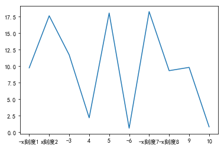
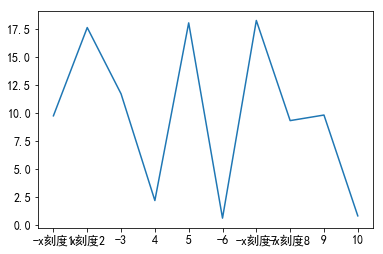
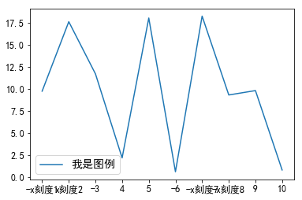
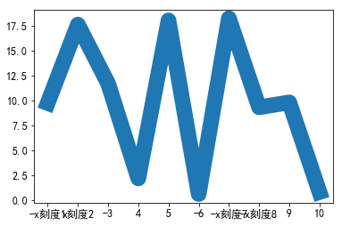
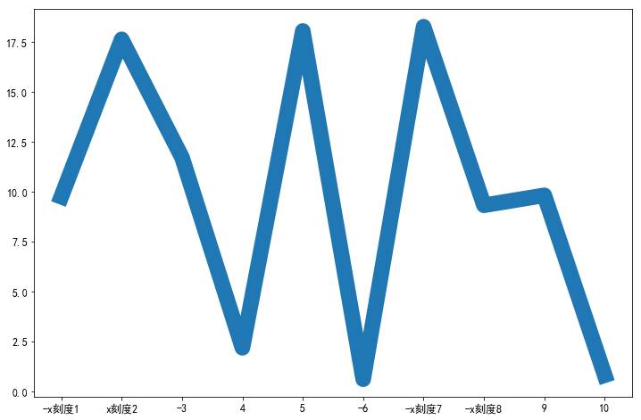
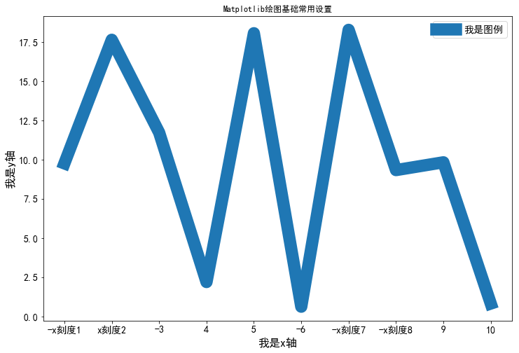
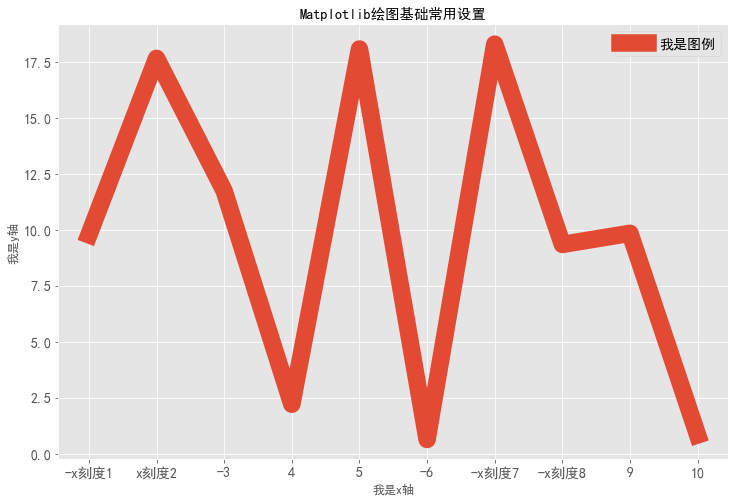

# 导入必要的库


```python
import matplotlib.pyplot as plt
```

### matplotlib是一个数据绘图库，可以将枯燥的数据转换成容易接收信息的图表
#### 我们来了解下一幅matplotlib图像的组成结构
+ 第一层：canvas 类似画板
+ 第二层：figure 类似画布（或理解为画图区域）
+ 第三层：axes 子图（或理解为坐标系）
+ 第四层：各类图表信息，包括：xaxis（x轴），yaxis（y轴），title（标题），legend（图例），grid（网格线），spines（边框线）,data（数据）等等
#### 所以，
+ canvas位于最底层，当我们导入matplotlib库的时候就已经存在了，我们不需要多管这个
+ figure建立在canvas之上，从这里就需要我们开始操作了
+ axes建立在figure之上
+ 图形以及坐标轴、图例等信息都是建立在Axes之上


```python
import matplotlib.pyplot as plt
import numpy as np # 用来生成绘图数据
```

+ NumPy系统是Python的一种开源的数值计算扩展。这种工具可用来存储和处理大型矩阵，比Python自身的嵌套列表(nested list structure)结构要高效的多(该结构也可以用来表示矩阵(matrix))。


```python
x =['-x刻度1','x刻度2',-3,4,5,-6,'-x刻度7','-x刻度8',9,10]
y = np.random.random(10)*20 #生成10个 0~20 之间的随机数

#根据x和y画图
plt.plot(x,y)

# 显示图形   
plt.show()
```


### x =['-x刻度1','x刻度2',-3,4,5,-6,'-x刻度7','-x刻度8',9,10] 
+这个列表里每个元素代表x轴的一个刻度
### y = np.random.random(10)*20  
+ np.random.random(10) # 生成10个 0~20 之间的随机数
+ np.random.random(10)*20 # 生成10个 0~20 之间的随机数,然后乘以20，变成0~20之间的数

### x轴不能显示中文


```python
# 正常显示中文标签，包括：xaxis（x轴），yaxis（y轴），title（标题），legend（图例）
plt.rcParams['font.sans-serif']=['SimHei']
#根据x和y画图
plt.plot(x,y)

# 显示图形   
plt.show()
```





### plt.rcParams['font.sans-serif']=['Microsoft YaHei','SimHei']
+ 宋体，仿宋，新宋体，黑体，楷体。windows路径C:\Windows\Fonts ，选中右键属性可以查看英文名字，只能windows,其他系统没试过

### plt.rcParams['axes.unicode_minus']=False
+ 有时候x轴或者y轴刻度负号不能显示，默认参数plt.rcParams['axes.unicode_minus']=True


```python
plt.rcParams['axes.labelsize']=20
#根据x和y画图
plt.plot(x,y)

plt.xlabel('我是x轴')
plt.ylabel('我是y轴')

# 显示图形   
plt.show()
```


### plt.rcParams['axes.labelsize']=20
+ 控制x和y轴的标签大小为20像素


```python
plt.rcParams['xtick.labelsize']=12
plt.rcParams['ytick.labelsize']=12
#根据x和y画图
plt.plot(x,y)

# 显示图形   
plt.show()
```





### plt.rcParams['xtick.labelsize']=12
### plt.rcParams['ytick.labelsize']=12
+ 控制x和y轴刻度大小


```python
plt.rcParams['legend.fontsize']=14
#根据x和y画图
plt.plot(x,y,label='我是图例')
#显示图例
plt.legend()
# 显示图形   
plt.show()
```





### 在 plot 的时候指定 label，然后调用 legend 方法可以绘制图例。
+ 控制图例大小为14像素


```python
plt.rcParams['lines.linewidth']=17.5

#根据x和y画图
plt.plot(x,y,label='我是图例')
#显示图例

# 显示图形   
plt.show()
```





### 设置关键参数 lines.linewidth 可以改变线的粗细，其值为浮点数。
+ 控制线的粗细为17.5像素


```python
plt.rcParams['figure.figsize']=[12,8]
#根据x和y画图
plt.plot(x,y,label='我是图例')
#显示图例

# 显示图形   
plt.show()
```





### plt.rcParams['figure.figsize']=[12,8]
+ 把图设置为12*8 大小

## 倒入模块就设置全局参数


```python
import matplotlib.pyplot as plt
import numpy as np
# 正常显示中文标签
plt.rcParams['font.sans-serif']=['SimHei']
# 用来正常显示负号
plt.rcParams['axes.unicode_minus']=False

# 刻度大小
plt.rcParams['axes.labelsize']=16
# 线的粗细
plt.rcParams['lines.linewidth']=17.5
# x轴标签大小
plt.rcParams['xtick.labelsize']=14
# y轴标签大小
plt.rcParams['ytick.labelsize']=14
#图例大小
plt.rcParams['legend.fontsize']=14
# 图大小
plt.rcParams['figure.figsize']=[12,8]

plt.xlabel('我是x轴')
plt.ylabel('我是y轴')
#设置绘图标题
plt.title('Matplotlib绘图基础常用设置')
#根据x和y画图
plt.plot(x,y,label='我是图例')
#显示图例
plt.legend()
# 显示图形   
plt.show()
```


### 另一种参数设置


```python
params={
    'axes.labelsize': '16',       
    'xtick.labelsize':'14',
    'ytick.labelsize':'14',
    'lines.linewidth':17.5 ,
    'legend.fontsize': '14',
    'figure.figsize'   : '12, 8'}
plt.rcParams.update(params)

plt.xlabel('我是x轴')
plt.ylabel('我是y轴')
#设置绘图标题
plt.title('Matplotlib绘图基础常用设置')
#根据x和y画图
plt.plot(x,y,label='我是图例')
#显示图例
plt.legend()
# 显示图形   
plt.show()
```





```python
plt.style.use("ggplot")

plt.xlabel('我是x轴')
plt.ylabel('我是y轴')
#设置绘图标题
plt.title('Matplotlib绘图基础常用设置')
#根据x和y画图
plt.plot(x,y,label='我是图例')
#显示图例
plt.legend()
# 显示图形   
plt.show()
```





## plt.style.use("ggplot") 
+ 样式美化(matplotlib.pyplot.style.use),定制画布风格


```python
# 获取所有的自带样式  
print(plt.style.available)
```

    ['bmh', 'classic', 'dark_background', 'fast', 'fivethirtyeight', 'ggplot', 'grayscale', 'seaborn-bright', 'seaborn-colorblind', 'seaborn-dark-palette', 'seaborn-dark', 'seaborn-darkgrid', 'seaborn-deep', 'seaborn-muted', 'seaborn-notebook', 'seaborn-paper', 'seaborn-pastel', 'seaborn-poster', 'seaborn-talk', 'seaborn-ticks', 'seaborn-white', 'seaborn-whitegrid', 'seaborn', 'Solarize_Light2', 'tableau-colorblind10', '_classic_test']
    
