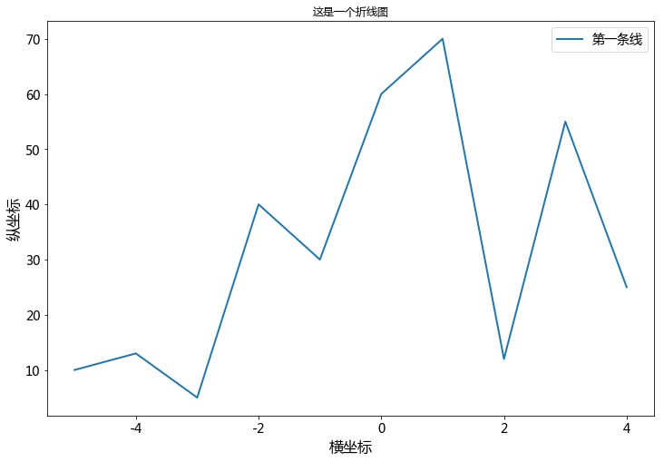
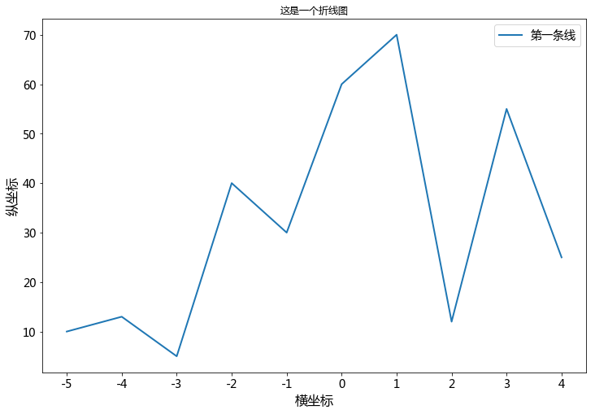
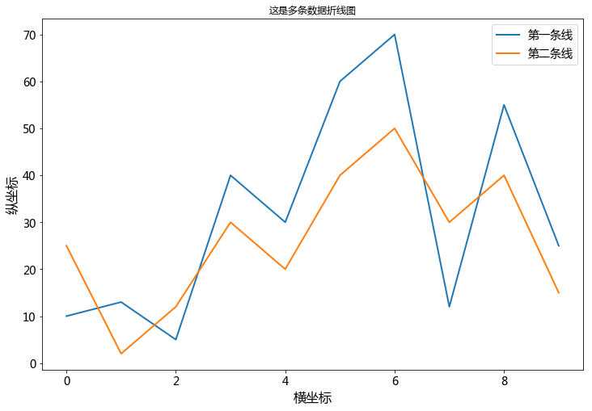
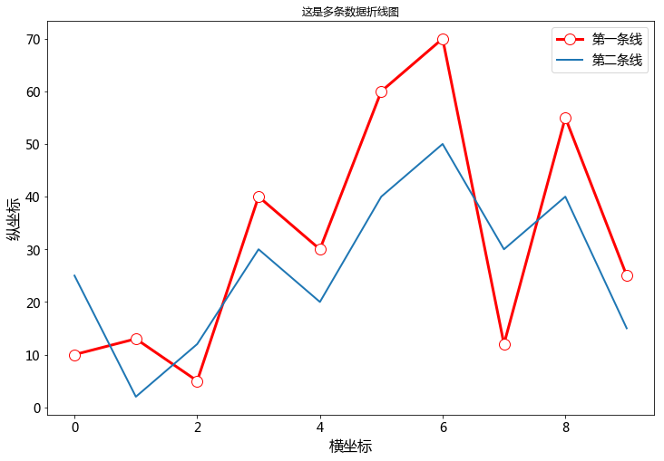
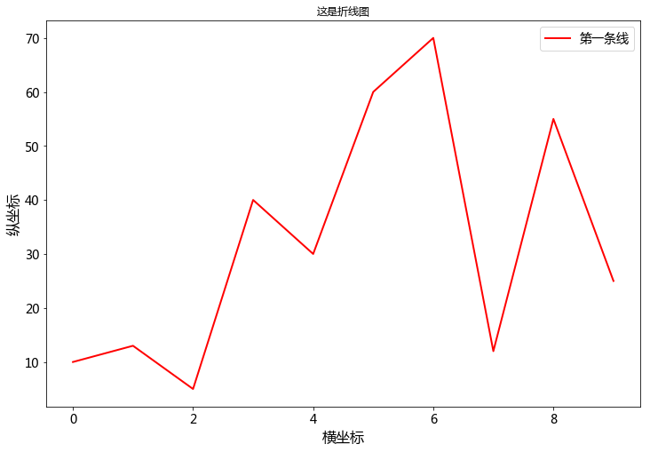
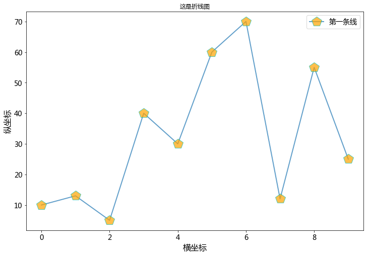

# 导入必要的库


```python
import numpy as np
import matplotlib.pyplot as plt
```


```python
# 用来正常显示负号
plt.rcParams['axes.unicode_minus']=False

# 刻度大小
plt.rcParams['axes.labelsize']=16
# 线的粗细
plt.rcParams['lines.linewidth']=2
# x轴标签大小
plt.rcParams['xtick.labelsize']=14
# y轴标签大小
plt.rcParams['ytick.labelsize']=14
#图例大小
plt.rcParams['legend.fontsize']=14
# 图大小
plt.rcParams['figure.figsize']=[12,8]
```


```python
# 生成-5~5 的10个数 array([-5, -4, -3, -2, -1,  0,  1,  2,  3,  4])
x = np.arange(-5,5)
y = [10,13,5,40,30,60,70,12,55,25] 

# 正常显示中文字体
plt.rcParams['font.sans-serif']=['Microsoft YaHei']

# 绘图，设置(label)图例名字为'第一条线'，显示图例plt.legend()
plt.plot(x,y,label='第一条线')

# x轴标签
plt.xlabel('横坐标')
# y轴标签
plt.ylabel('纵坐标')

# 可视化图标题
plt.title('这是一个折线图')

# 显示图例
plt.legend()
# 显示图形
plt.show() 
```





## 图例

在 plot 的时候指定 label，然后调用 legend 方法可以绘制图例。例如：plt.legend()

legend 方法可接受一个 loc 关键字参数来设定图例的位置，可取值为数字或字符串：<br>
+ 0: 'best' (自适应方式)
+ 1: 'upper right'
+ 2: 'upper left'
+ 3: 'lower left'
+ 4: 'lower right'
+ 5: 'right'
+ 6: 'center left'
+ 7: 'center right'
+ 8: 'lower center'
+ 9: 'upper center'
+ 10: 'center'

loc 设置显示的位置，0是自适应  
ncol 设置显示的列数  
plt.legend(loc = 0, ncol = 2)  


```python
# 生成-5~5 的10个数 array([-5, -4, -3, -2, -1,  0,  1,  2,  3,  4])
x=np.arange(-5,5)
y=[10,13,5,40,30,60,70,12,55,25] 

# 正常显示中文字体
plt.rcParams['font.sans-serif']=['Microsoft YaHei']

# 绘图，设置(label)图例名字为'第一条线'，显示图例plt.legend()
plt.plot(x,y,label='第一条线')

# x轴标签
plt.xlabel('横坐标')
# y轴标签
plt.ylabel('纵坐标')

# 修改x坐标刻度让它显示为array([-5, -4, -3, -2, -1,  0,  1,  2,  3,  4])
plt.xticks(x)

# 可视化图标题
plt.title('这是一个折线图')

# 显示图例
plt.legend()
# 显示图形
plt.show() 
```





# 画多条折线


```python
# 第一组数据
x1=np.arange(0,10) 
y1=[10,13,5,40,30,60,70,12,55,25] 

# 第二组数据
x2=np.arange(0,10) 
y2=[25,2,12,30,20,40,50,30,40,15]

# 第n组数据,有多少组数据，就可以画多条折线
# x = np.arange(0,10) 
# y = [25,2,12,30,20,40,50,30,40,15]


# 画第一条折线
plt.plot(x1,y1,label='第一条线')

# 画第二条折线
plt.plot(x2,y2,label='第二条线')

# 画第n条折线
# plt.plot(x,y,label='第n条线')

# x轴标签
plt.xlabel('横坐标')
# y轴标签
plt.ylabel('纵坐标')

# 可视化图标题
plt.title('这是多条数据折线图')

# 显示图例
plt.legend()
# 显示图形
plt.show() 
```





```python
# 第一组数据
x1=np.arange(0,10) 
y1=[10,13,5,40,30,60,70,12,55,25] 

# 第二组数据
x2=np.arange(0,10) 
y2=[25,2,12,30,20,40,50,30,40,15]

plt.plot(x1,y1,label='第一条线',color='r',linewidth=3,marker='o',mfc='w',markersize=12,mfcalt='b') 
plt.plot(x2,y2,label='第二条线',linewidth=2)


# x轴标签
plt.xlabel('横坐标')
# y轴标签
plt.ylabel('纵坐标')

# 可视化图标题
plt.title('这是多条数据折线图')

# 显示图例
plt.legend()
# 显示图形
plt.show() 
```





### 线的样式

#### （1）颜色

plot 方法的关键字参数 color(或c) 用来设置线的颜色。可取值为：

* 颜色名称或简写
>* 'b'    blue(蓝色)  
>* 'g'    green(绿色)  
>* 'r'    red(红色)  
>* 'c'    cyan(青色)  
>* 'm'    magenta(品红)  
>* 'y'    yellow(黄色)  
>* 'k'    black(黑色)  
>* 'w'    white(白色)  
>* rgb
* (r, g, b) 或 (r, g, b, a)，其中 r g b a 取均为[0, 1]之间
* [0, 1]之间的浮点数的字符串形式，表示灰度值。0表示黑色，1表示白色

#### （2）样式

plot 方法的关键字参数 linestyle(或ls) 用来设置线的样式。可取值为：

* '-', 'solid'
* '--', 'dashed'
* '-.', 'dashdot'
* ':', 'dotted'
* '', ' ', 'None'
#### （3）粗细

设置 plot 方法的关键字参数 linewidth(或lw) 可以改变线的粗细，其值为浮点数。

### marker

以下关键字参数可以用来设置marker的样式：

* marker 标记类型
* markeredgecolor 或 mec 标记边界颜色
* markeredgewidth 或 mew 标记宽度
* markerfacecolor 或 mfc 标记填充色
* markersize 或 ms 标记大小

#### 其中 marker 可取值为：

* '-'      实线  
* '--'    虚线  
* '-.'    点与线  
* ':'     点  
* '.'     点标记  
* ','    像素标记  
* 'o'    圆圈标记  
* 'v'    倒三角标记  
* '^'    正三角标记  
* '<'    左三角标记  
* '>'    右三角标记  
* '1'     向下Y标记  
* '2'    向上Y标记  
* '3'    向左Y标记  
* '4'    向右Y标记  
* 's'    正方形标记  
* 'p'    五角星标记  
* '*'     *标记  
* 'h'    六边形1 标记  
* 'H'    六边形2 标记  
* '+'    +标记  
* 'x'    x标记  
* 'D'    钻石标记  
* 'd'    薄砖石标记  
* '|'    垂直线标记  
* '_'    水平线标记  


```python
# 第一组数据
x1=np.arange(0,10) 
y1=[10,13,5,40,30,60,70,12,55,25] 


# 画一条红色的折线
plt.plot(x1,y1,label='第一条线',color='r') 

# plot 方法的关键字参数 color(或c) 用来设置线的颜色。可取值为：
# 'b' blue(蓝色)
# 'g' green(绿色)
# 'r' red(红色)
# 'c' cyan(青色)
# 'm' magenta(品红)
# 'y' yellow(黄色)
# 'k' black(黑色)
# 'w' white(白色)
# rgb


# x轴标签
plt.xlabel('横坐标')
# y轴标签
plt.ylabel('纵坐标')

# 可视化图标题
plt.title('这是折线图')

# 显示图例
plt.legend()
# 显示图形
plt.show() 
```





```python
# 第一组数据
x1=np.arange(0,10) 
y1=[10,13,5,40,30,60,70,12,55,25] 


# 画一条折线
plt.plot(x1,y1,label='第一条线',marker='p',mfc='orange',ms=20,alpha=0.7,mec='c') 

# marker='p' 标记为五边形
# mfc='orange'  标记为黄色
# ms=20 标记大小为20
# mec='c' 标记边框颜色为 'c' cyan(青色)
# alpha=0.7 透明度为0.7


# x轴标签
plt.xlabel('横坐标')
# y轴标签
plt.ylabel('纵坐标')

# 可视化图标题
plt.title('这是折线图')

# 显示图例
plt.legend()
# 显示图形
plt.show() 
```




