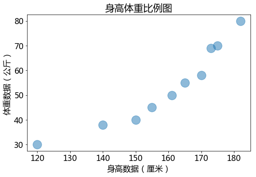
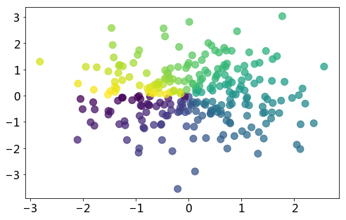
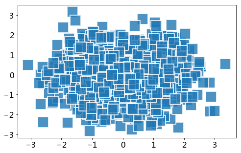
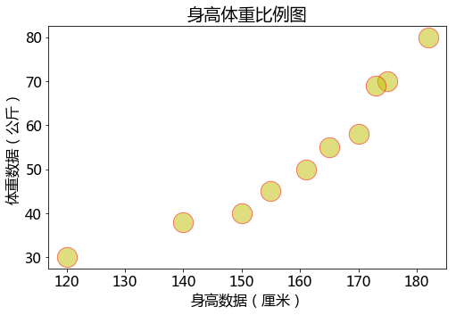

# 概念

什么是散点图？
反映两组变量每个数据点的值，并且从散点图可以看出它们之间的相关性

## 参数介绍
plt.scatter(x, y, s=None, c=None, marker=None, cmap=None, norm=None, vmin=None, vmax=None, alpha=None, linewidths=None, verts=None, edgecolors=None)

+ x,y 形如shape(n,)的数组，可选值
+ s 代表点的大小
+ c 代表点的填充颜色,点的颜色或颜色序列，默认蓝色。其它如c = 'r' (red); c = 'g' (green); c = 'k' (black) ; c = 'y'(yellow)
+ marker 点的形状,可选值，默认是圆 
> * '-'      实线  
> * '--'    虚线  
> * '-.'    点与线  
> * ':'     点  
> * '.'     点标记  
> * ','    像素标记  
> * 'o'    圆圈标记  
> * 'v'    倒三角标记  
> * '^'    正三角标记  
> * '<'    左三角标记  
> * '>'    右三角标记  
> * '1'     向下Y标记  
> * '2'    向上Y标记  
> * '3'    向左Y标记  
> * '4'    向右Y标记  
> * 's'    正方形标记  
> * 'p'    五角星标记  
> * '*'     *标记  
> * 'h'    六边形1 标记  
> * 'H'    六边形2 标记  
> * '+'    +标记  
> * 'x'    x标记  
> * 'D'    钻石标记  
> * 'd'    薄砖石标记  
> * '|'    垂直线标记  
> * '_'    水平线标记 
+ alpha：标量，可选，默认值：无， 0（透明）和1（不透明）之间的alpha混合值
+ edgecolors 点的边界颜色或颜色序列，可选值，默认值：None


```python
import numpy as np
import matplotlib.pyplot as plt
```


```python
# 正常显示中文标签
plt.rcParams['font.sans-serif']=['Microsoft YaHei']
# 设置图大小8*5
plt.rcParams['figure.figsize']=[8,5]

# 设置字体大小
plt.rcParams['font.size']=16

# x轴标签大小
plt.rcParams['xtick.labelsize']=16
# y轴标签大小
plt.rcParams['ytick.labelsize']=16
```


```python
# 身高数据（厘米）
height = [140,161,170,182,175,173,165,155,150,120]
# 体重数据（公斤）
weight = [38,50,58,80,70,69,55,45,40,30]
# 散点图
plt.scatter(height,weight,s=300,alpha=0.5)

plt.title('身高体重比例图')
plt.xlabel('身高数据（厘米）')
plt.ylabel('体重数据（公斤）')
plt.show()
```





```python
n = 258
x = np.random.normal(0,1,n)
y = np.random.normal(0,1,n)
t = np.arctan2(y,x) # 颜色值 atan2() 返回给定的 X 及 Y 坐标值的反正切值。

# s=75 大小 ,c=t 颜色数量
plt.scatter(x,y,s=100,c=t,alpha=0.75)

plt.show()
```





```python
N = 1000
x = np.random.randn(N) # 生成符合正态分布的 1000 个数据
y = np.random.randn(N)
# 点的边界颜色白色，大小500，marker 正方形标记,点的边界 2 (白边)，透明度0.8
plt.scatter(x, y,alpha=0.8,edgecolors= 'w',s=500,marker='s', linewidths=2)
plt.show()
```





```python
# 身高数据（厘米）
height = [140,161,170,182,175,173,165,155,150,120]
# 体重数据（公斤）
weight = [38,50,58,80,70,69,55,45,40,30]
# 散点图
plt.scatter(height,weight,s=500,c='y',alpha=0.5,edgecolors= 'r')

plt.title('身高体重比例图')
plt.xlabel('身高数据（厘米）')
plt.ylabel('体重数据（公斤）')
plt.show()
```




