```python
import matplotlib.pyplot as plt
```

# 柱状图
>应用于比较分类变量的数值，例如可以用于展示衣服裤子鞋子等商品的销售量。

## 主要参数介绍：
bar(left, height, width=0.8, bottom=None, **kwargs)
1. left为和分类数量一致的数值序列，序列里的数值数量决定了柱子的个数，数值大小决定了距离0点的位置
2. height为分类变量的数值大小，决定了柱子的高度
3. width决定了柱子的宽度，仅代表形状宽度而已
4. bottom决定了柱子距离x轴的高度，默认为None，即表示与x轴距离为0

事实上，left，height，width，bottom这四个参数确定了柱体的位置和大小。默认情况下，left为柱体的居中位置（可以通过align参数来改变left值的含义）


```python
# 正常显示中文标签
plt.rcParams['font.sans-serif']=['SimHei']
# 用来正常显示负号
plt.rcParams['axes.unicode_minus']=False

plt.rcParams['axes.labelsize']=16
plt.rcParams['xtick.labelsize']=14
plt.rcParams['ytick.labelsize']=14
plt.rcParams['legend.fontsize']=12
plt.rcParams['figure.figsize']=[16,6]
# 使用样式
plt.style.use("ggplot")
```


```python
label = ["a","b","c","d","e"]
x = [0,1,2,3,4]
y = [30,20,15,25,10]
```

## width决定了柱子的宽度，仅代表形状宽度而已，默认为0.8


```python
fig = plt.figure()

# 生成第一个子图在1行2列第一列位置
ax1 = fig.add_subplot(121)

# 生成第二子图在1行2列第二列位置
ax2 = fig.add_subplot(122)

# 绘图并设置柱子宽度0.5
ax1.bar(x, y, width=0.5)

# 绘图默认柱子宽度0.8
ax2.bar(x, y)

plt.show()
```


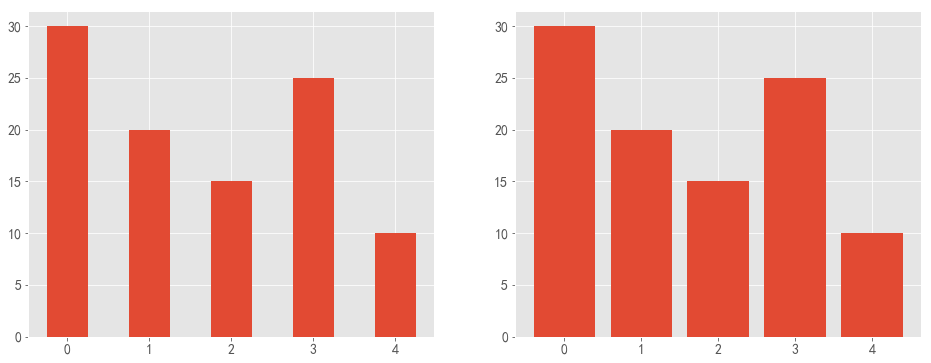


## 设置x轴刻度（tick_label）用 label = ["a","b","c","d","e"] 显示


```python
fig = plt.figure()

# 生成第一个子图在1行2列第一列位置
ax1 = fig.add_subplot(121)

# 生成第二子图在1行2列第二列位置
ax2 = fig.add_subplot(122)

# 绘图并设置柱子宽度0.5
ax1.bar(x, y, width=0.5)

# 绘图默认柱子宽度0.8,设置x轴刻度（tick_label）用 label = ["a","b","c","d","e"] 显示
ax2.bar(x, y,tick_label=label)

plt.show()
```


## bottom决定了柱子距离x轴的高度，默认为None，即表示与x轴距离为0


```python
fig,ax = plt.subplots(figsize=(8,5),dpi=80)

# 设置第一个柱子离x轴 为5 ，第二、三、五个柱子不变，第四个柱子离x轴 为8 
ax.bar(x,y,width=0.3,bottom=[5,0,0,8,0])

plt.show()
```


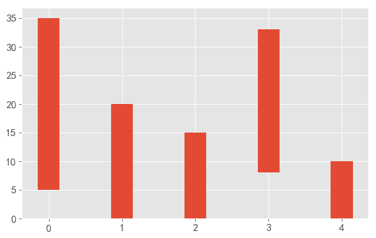


## 设置柱体颜色
通过 facecolor(或fc) 关键字参数可以设置柱体颜色

通过 color 关键字参数 可以一次性设置多个颜色


```python
fig = plt.figure()

# 生成第一个子图在1行2列第一列位置
ax1 = fig.add_subplot(121)

# 生成第二子图在1行2列第二列位置
ax2 = fig.add_subplot(122)

ax1.bar(x, y, fc='c')

ax2.bar(x, y,color=['r', 'g', 'b']) # 或者color='rgb' , color='#FFE4C4'

plt.show()
```


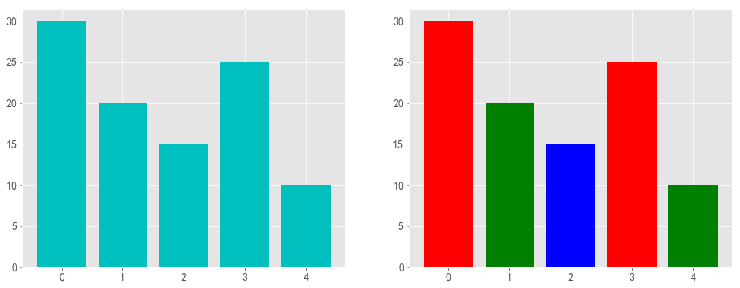


## 设置柱体描边

相关的关键字参数为：

+ edgecolor 或 ec 描边颜色
+ linestyle 或 ls 描边样式
+ linewidth 或 lw 描边宽度


```python
# edgecolor 或 ec 描边颜色为（cyan），linestyle 或 ls 描边样式 （-.）， linewidth 或 lw 描边宽度（5），柱子颜色（#EECFA1）
plt.bar(x, y, ec='c', ls='-.', lw=5,color='#EECFA1')
plt.show()
```


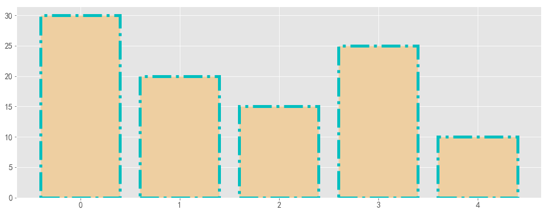


## 设置柱体描边填充
hatch 关键字可用来设置填充样式，可取值为： / , \ , | , - , + , x , o , O , . , * 。


```python
plt.bar(x, y, ec='c', ls='-.', lw=5,color='#EEDC82',hatch='*')
plt.show()
```


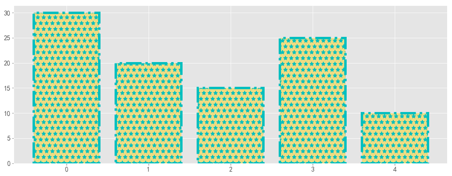


## 其他柱状图类型

### （1）堆积柱状图

通过 bottom 参数，可以绘制堆叠柱状图。


```python
#显示中文字体为SimHei
plt.rcParams["font.sans-serif"]=["SimHei"]

sale8 = [10,20,30,15,18]
sale9 = [10,12,24,32,8]

# x轴的刻度为1-5号衣服
labels = ["{}号衣服".format(i) for i in range(1,6)]

fig,ax = plt.subplots(figsize=(12,6),dpi=80)


ax.bar(range(len(sale8)),sale8,tick_label=labels,label="8月")

# 九月的bottom是sale8，也就是八月，所以九月在上边
ax.bar(range(len(sale9)),sale9,bottom=sale8,tick_label=labels,label="9月")
ax.legend()
plt.show()
```


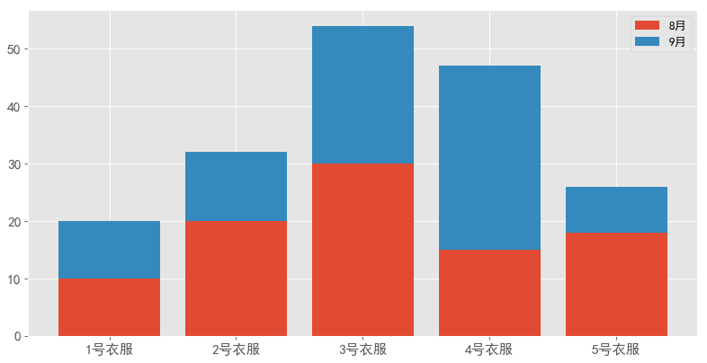


## （2）并列柱状图

绘制并列柱状图与堆叠柱状图类似，都是绘制多组柱体，只需要控制好每组柱体的位置和大小即可。


```python
import numpy as np
#显示中文字体为SimHei
plt.rcParams['font.sans-serif']=['SimHei']

sale8 = [5,20,15,25,10]
sale9 = [10,15,25,30,5]

# x轴的刻度为1-5号衣服
labels = ["{}号衣服".format(i) for i in range(1,6)]

fig,ax = plt.subplots(figsize=(8,5),dpi=80)
width_1 = 0.4

ax.bar(np.arange(len(sale8)),sale8,width=width_1,tick_label=labels,label = "8月")

ax.bar(np.arange(len(sale9))+width_1,sale9,width=width_1,tick_label=labels,label="9月")

ax.legend()
plt.show()
```


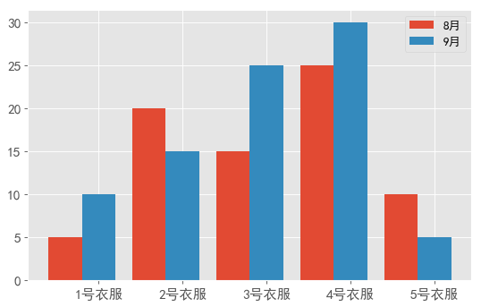


# 条形图
使用 barh 方法绘制条形图

### plt.barh 方法的签名为：
>barh(bottom, width, height=0.8, left=None, **kwargs)
### 可以看到与 plt.bar 方法类似。所以堆积条形图和并列条形图的画法与前面类似。


```python
plt.barh(x, y)
plt.show()
```


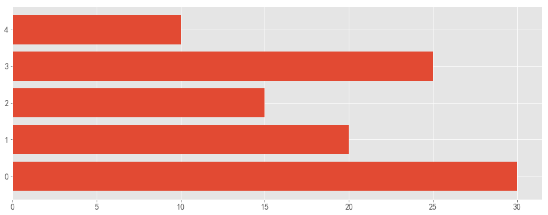


## 正负条形图


```python
import numpy as np
import matplotlib.pyplot as plt

x = np.array([5, 20, 15, 25, 10])
y = np.array([11, 15, 22, 14, 5])

plt.barh(range(len(x)), x)
plt.barh(range(len(y)), -y)
plt.show()
```


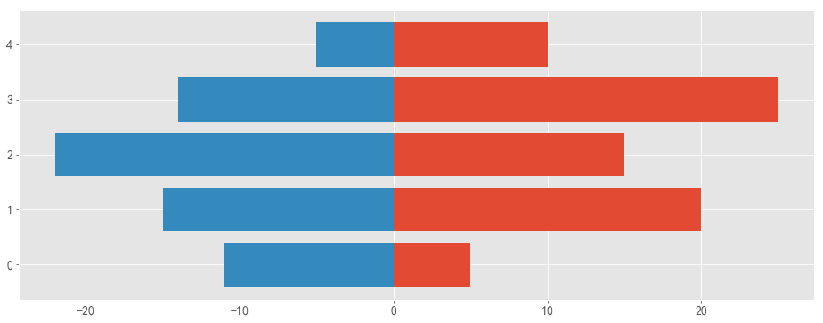


#### 案例一：同一本书不同平台最低价比较
很多人在买一本书的时候，都比较喜欢货比三家，例如《python数据分析实战》在亚马逊、当当网、中国图书网、京东和天猫的最低价格分别为39.5、39.9、45.4、38.9、33.34。针对这个数据，我们也可以通过条形图来完成，这里使用水平条形图来显示：


```python
import matplotlib.pyplot as plt
import numpy as np
```


```python
# 正常显示中文标签
plt.rcParams['font.sans-serif']=['SimHei']
# 用来正常显示负号
plt.rcParams['axes.unicode_minus']=False

plt.rcParams['axes.labelsize']=16
plt.rcParams['xtick.labelsize']=14
plt.rcParams['ytick.labelsize']=14
plt.rcParams['legend.fontsize']=12
plt.rcParams['figure.figsize']=[15,15]
plt.style.use("ggplot")
```


```python
price = [39.5,39.9,45.4,38.9,33.34]
for x,y in enumerate(price):
    print(x,y)
```

    0 39.5
    1 39.9
    2 45.4
    3 38.9
    4 33.34
    


```python
fig,ax = plt.subplots(figsize=(12,5),dpi=80)

x = range(len(price))
# 添加刻度标签
labels = np.array(['亚马逊','当当网','中国图书网','京东','天猫'])
#在子图对象上画条形图，并添加x轴标签，图形的主标题
ax.barh(x,price,tick_label=labels,alpha = 0.8)

ax.set_xlabel('价格',color='k')
ax.set_title('不同平台书的最低价比较')

# 设置Y轴的刻度范围
ax.set_xlim([32,47])

# 为每个条形图添加数值标签
for x,y in enumerate(price):
    ax.text(y+0.2,x,y,va='center',fontsize=14)
    
# 显示图形   
plt.show()
```


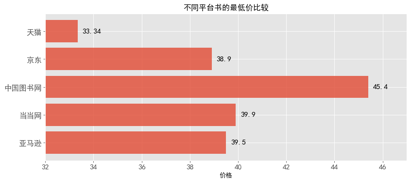


### 代码解读
水平条形图的绘制与垂直条形图的绘制步骤一致，只是调用了barh函数来完成。需要注意的是，条形图的数值标签设置有一些不一样，需要将标签垂直居中显示，使用va参数即可。

#### 案例二：胡润财富榜：亿万资产超高净值家庭数
利用水平交错条形图对比2016年和2017年亿万资产超高净值家庭数（top5），其数据如下：


```python
import matplotlib.pyplot as plt
import numpy as np
```


```python
# 正常显示中文标签
plt.rcParams['font.sans-serif']=['SimHei']
# 用来正常显示负号
plt.rcParams['axes.unicode_minus']=False

plt.rcParams['axes.labelsize']=16
plt.rcParams['xtick.labelsize']=14
plt.rcParams['ytick.labelsize']=14
plt.rcParams['legend.fontsize']=16
plt.rcParams['figure.figsize']=[12,10]
plt.style.use("ggplot")
```


```python
# 构建数据
Y2016 = [15600,12700,11300,4270,3620]
Y2017 = [17400,14800,12000,5200,4020]
labels = ['北京','上海','香港','深圳','广州']
bar_width = 0.35
x = np.arange(len(Y2016))
```


```python
fig = plt.figure()
ax = fig.add_subplot(111)

# 绘图
ax.bar(x,Y2016,label='Y2016',width=bar_width)
ax.bar(x+bar_width,Y2017,label='Y2017',width=bar_width)
# 添加轴标签
ax.set_xlabel('Top5城市')
ax.set_ylabel('家庭数量')
# 添加标题
ax.set_title('亿万财富家庭数Top5城市分布',fontsize=16)
# 添加刻度标签
plt.xticks(x+bar_width,labels)
# 设置Y轴的刻度范围
plt.ylim([2500, 19000])

# 为每个条形图添加数值标签
for x2016,y2016 in enumerate(Y2016):
    plt.text(x2016, y2016+200, y2016,ha='center',fontsize=16)

for x2017,y2017 in enumerate(Y2017):
    plt.text(x2017+0.35,y2017+200,y2017,ha='center',fontsize=16)
    
# 显示图例
ax.legend()
# 显示图形
plt.show()
```


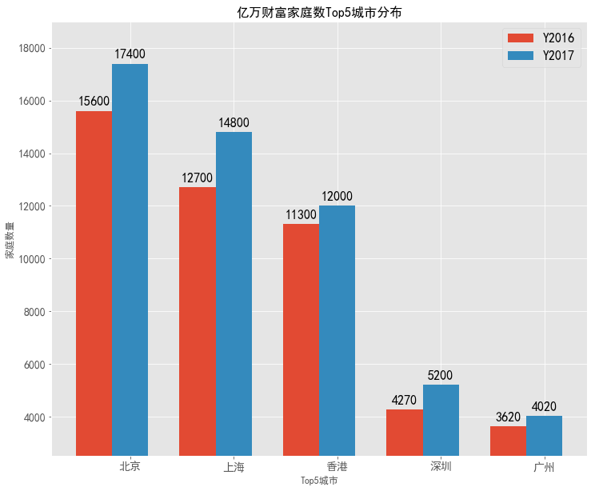

### 代码解读
水平交错条形图绘制的思想很简单，就是在第一个条形图绘制好的基础上，往左移一定的距离，再去绘制第二个条形图，所以在代码中会出现两个bar函数；
图例的绘制需要在bar函数中添加label参数；color和alpha参数分别代表条形图的填充色和透明度；
给条形图添加数值标签，同样需要使用两次for循环的方式实现；

