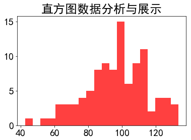
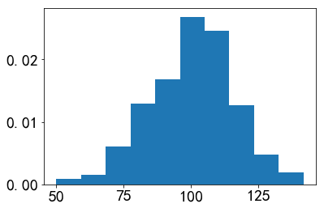
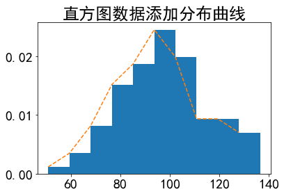
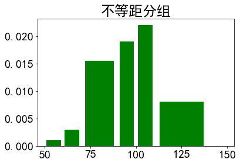
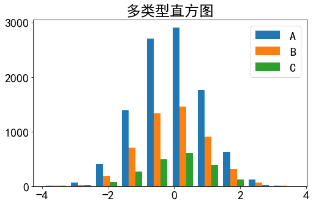

```python
import matplotlib.pyplot as plt
import numpy as np
```

## 直方图参数

plt.hist(x, bins=None, range=None, density=None, weights=None, cumulative=False, bottom=None, histtype='bar', align='mid', orientation='vertical', rwidth=None, log=False, color=None, label=None, stacked=False, normed=None)

* x：指定要绘制直方图的数据；输入值，这需要一个数组或者一个序列，不需要长度相同的数组。
* bins：指定直方图条形的个数；
* range：指定直方图数据的上下界，默认包含绘图数据的最大值和最小值；
* density：布尔,可选。如果"True"，返回元组的第一个元素将会将计数标准化以形成一个概率密度，也就是说，直方图下的面积（或积分）总和为1。这是通过将计数除以数字的数量来实现的观察乘以箱子的宽度而不是除以总数数量的观察。如果叠加也是“真实”的，那么柱状图被规范化为1。(替代normed)
* weights：该参数可为每一个数据点设置权重；
* cumulative：是否需要计算累计频数或频率；
* bottom：可以为直方图的每个条形添加基准线，默认为0；
* histtype：指定直方图的类型，默认为bar，除此还有’barstacked’, ‘step’, ‘stepfilled’；
* align：设置条形边界值的对其方式，默认为mid，除此还有’left’和’right’；
* orientation：设置直方图的摆放方向，默认为垂直方向；
* rwidth：设置直方图条形宽度的百分比；
* log：是否需要对绘图数据进行log变换；
* color：设置直方图的填充色；
* label：设置直方图的标签，可通过legend展示其图例；
* stacked：当有多个数据时，是否需要将直方图呈堆叠摆放，默认水平摆放；
* normed：是否将直方图的频数转换成频率；(弃用，被density替代)
* alpha：透明度，浮点数。

## 返回值

### n : 数组或数组列表

直方图的值


### bins : 数组

返回各个bin的区间范围

### patches : 列表的列表或列表

返回每个bin里面包含的数据，是一个list


```python
plt.rcParams['font.family']='SimHei'
plt.rcParams['font.size']=20

# 直方图
mu = 100
sigma = 20
x = np.random.normal(100,20,100) # 均值和标准差

plt.hist(x,bins=20,color='red',histtype='stepfilled',alpha=0.75)
plt.title('直方图数据分析与展示')
plt.show()
```





## 等距直方图


```python
mu = 100  # 平均分布
sigma = 15  # 标准偏差的分布
x = mu + sigma * np.random.randn(500)

# 指定分组个数
num_bins = 10


# 通过调用 as.hist 函数，来生成组数为 10 的直方图：

fig, ax = plt.subplots()
n, bins_limits, patches = ax.hist(x, num_bins, density=1)

print("n 是分组区间对应的频率：",n,end="\n\n")
print("bins_limits 是分组时的分隔值：",bins_limits,end="\n\n")
print("patches 指的是是直方图中列表对象",type(patches),end="\n\n")

for a,b in enumerate(patches):
    print(a,b) # 遍历取出patches列表的序列和值


```

    n 是分组区间对应的频率： [0.00087199 0.00152598 0.00610392 0.01286182 0.01678577 0.02681363
     0.02463366 0.01264383 0.00479593 0.00196197]
    
    bins_limits 是分组时的分隔值： [ 50.03282244  59.2072611   68.38169976  77.55613842  86.73057707
      95.90501573 105.07945439 114.25389305 123.42833171 132.60277037
     141.77720903]
    
    patches 指的是是直方图中列表对象 <class 'matplotlib.cbook.silent_list'>
    
    0 Rectangle(xy=(50.0328, 0), width=9.17444, height=0.000871988, angle=0)
    1 Rectangle(xy=(59.2073, 0), width=9.17444, height=0.00152598, angle=0)
    2 Rectangle(xy=(68.3817, 0), width=9.17444, height=0.00610392, angle=0)
    3 Rectangle(xy=(77.5561, 0), width=9.17444, height=0.0128618, angle=0)
    4 Rectangle(xy=(86.7306, 0), width=9.17444, height=0.0167858, angle=0)
    5 Rectangle(xy=(95.905, 0), width=9.17444, height=0.0268136, angle=0)
    6 Rectangle(xy=(105.079, 0), width=9.17444, height=0.0246337, angle=0)
    7 Rectangle(xy=(114.254, 0), width=9.17444, height=0.0126438, angle=0)
    8 Rectangle(xy=(123.428, 0), width=9.17444, height=0.00479593, angle=0)
    9 Rectangle(xy=(132.603, 0), width=9.17444, height=0.00196197, angle=0)
    





### xy：xy位置（x取值bins_limits 是分组时的分隔值，y取值都是0开始）
### width ：宽度为各个bin的区间范围（bins_limits 是分组时的分隔值）
### height ：高度也就是密度值（n 是分组区间对应的频率）
### angle：角度

## 添加分布曲线


```python
plt.rcParams['font.family']='SimHei'
plt.rcParams['font.size']=20

mu = 100
sigma = 20
x = np.random.normal(100,20,100) # 均值和标准差

# 指定分组个数
num_bins = 10


fig, ax = plt.subplots()

# 绘图并接受返回值
n, bins_limits, patches = ax.hist(x, num_bins, density=1)


# 添加分布曲线
ax.plot(bins_limits[:10],n,'--')


plt.title('直方图数据添加分布曲线')
plt.show()
```





## 不等距分组
上面的直方图都是等距的，但有时我们需要得到不等距的直方图，这个时候只需要确定分组上下限，并指定 histtype="bar" 就可以


```python
fig, ax = plt.subplots()
bins = [50, 60, 70, 90, 100,110, 140, 150]
ax.hist(x, bins, density=1, histtype='bar', color="g",rwidth=0.8)
ax.set_title('不等距分组')
plt.show()
```





## 多类型直方图


```python
# 用来正常显示负号
plt.rcParams['axes.unicode_minus']=False

# 指定分组个数
n_bins=10

fig,ax=plt.subplots(figsize=(8,5))

# 分别生成10000 ， 5000 ， 2000 个值
x_multi = [np.random.randn(n) for n in [10000, 5000, 2000]]


# 实际绘图代码与单类型直方图差异不大，只是增加了一个图例项
# 在 ax.hist 函数中先指定图例 label 名称
ax.hist(x_multi, n_bins, histtype='bar',label=list("ABC"))

ax.set_title('多类型直方图')

# 通过 ax.legend 函数来添加图例
ax.legend()

plt.show()
```




