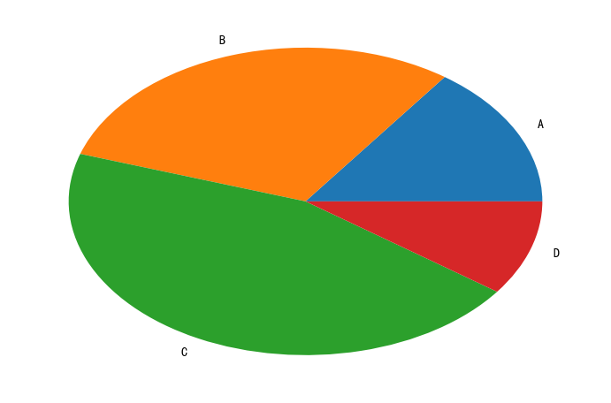
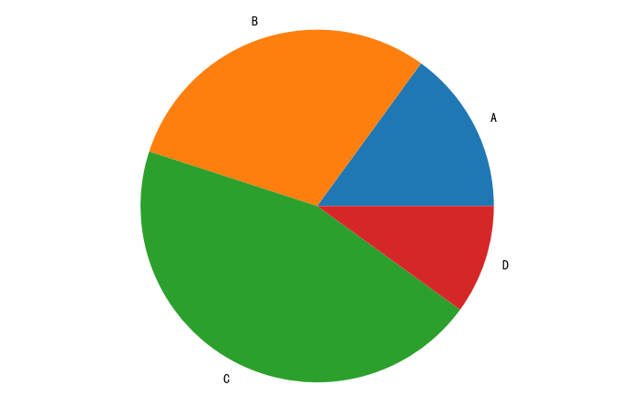
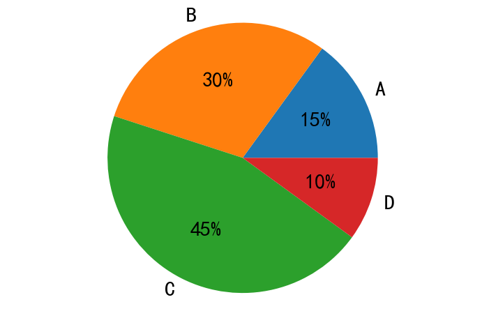
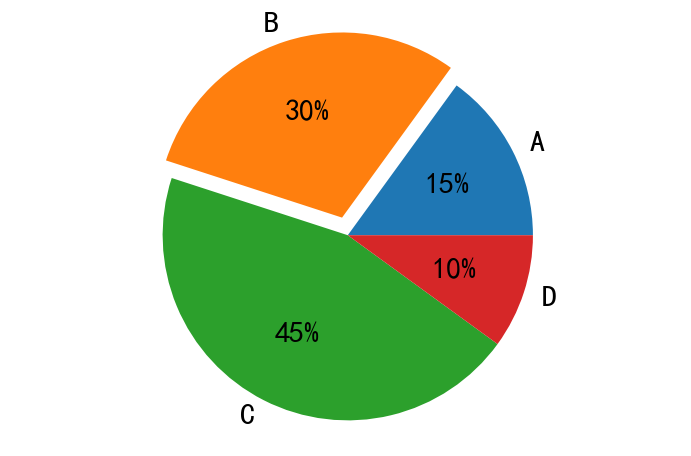
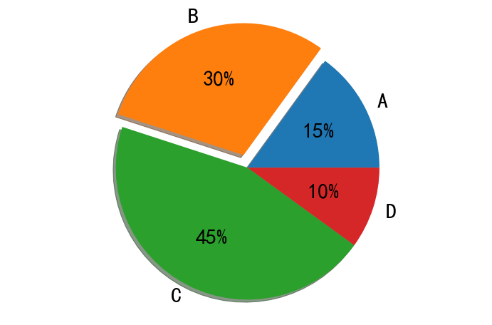
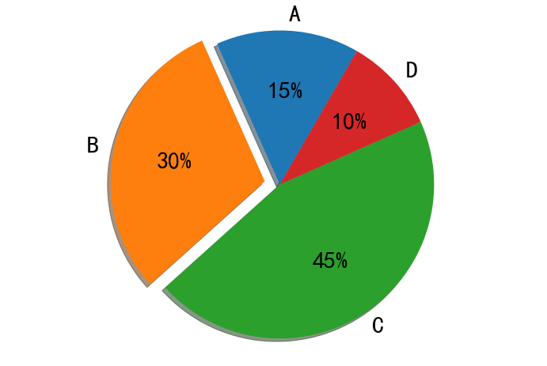
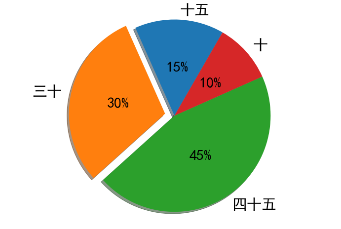
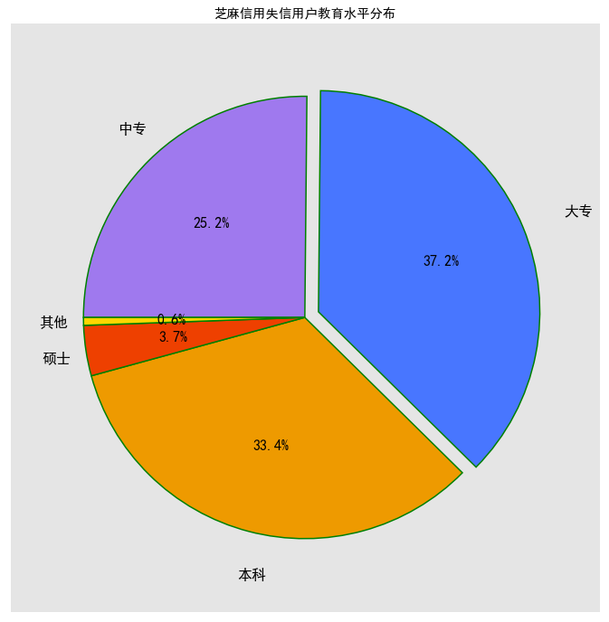

# 前言
## pie函数参数解读
plt.pie(x, explode=None, labels=None, colors=None, autopct=None, pctdistance=0.6, shadow=False, labeldistance=1.1, startangle=None, radius=None, counterclock=True, wedgeprops=None, textprops=None, center=(0, 0), frame=False)

* x：指定绘图的数据；

* explode：指定饼图某些部分的突出显示，即呈现爆炸式；

* labels：为饼图添加标签说明，类似于图例说明；

* colors：指定饼图的填充色；

* autopct：自动添加百分比显示，可以采用格式化的方法显示；

* pctdistance：设置百分比标签与圆心的距离；

* shadow：是否添加饼图的阴影效果；

* labeldistance：设置各扇形标签（图例）与圆心的距离；

* startangle：设置饼图的初始摆放角度；

* radius：设置饼图的半径大小；

* counterclock：是否让饼图按逆时针顺序呈现；

* wedgeprops：设置饼图内外边界的属性，如边界线的粗细、颜色等；

* textprops：设置饼图中文本的属性，如字体大小、颜色等；

* center：指定饼图的中心点位置，默认为原点

* frame：是否要显示饼图背后的图框，如果设置为True的话，需要同时控制图框x轴、y轴的范围和饼图的中心位置；


```python
import matplotlib.pyplot as plt
```


```python
# 正常显示中文标签
plt.rcParams['font.sans-serif']=['SimHei']
# 用来正常显示负号
plt.rcParams['axes.unicode_minus']=False

# 刻度大小
plt.rcParams['axes.labelsize']=16
# 线的粗细
plt.rcParams['lines.linewidth']=2
# x轴标签大小
plt.rcParams['xtick.labelsize']=14
# y轴标签大小
plt.rcParams['ytick.labelsize']=14
#图例大小
plt.rcParams['legend.fontsize']=14
# 图大小
plt.rcParams['figure.figsize']=[12,8]
```

## 绘制饼状图 默认椭圆


```python
#定义饼状图的标签，标签是列表
labels =[ 'A','B','C','D']

#每个标签占多大，会自动去算百分比
x = [15,30,45,10]

# 绘制饼图
plt.pie(x,labels=labels)

plt.show()
```





## 绘制饼状图-正圆


```python
#定义饼状图的标签，标签是列表
labels =[ 'A','B','C','D']

#每个标签占多大，会自动去算百分比
x = [15,30,45,10]

# 绘制饼图
plt.pie(x,labels=labels)

# 设置x，y轴刻度一致，这样饼图才能是圆的
plt.axis('equal')

plt.show()
```





## 绘制饼状图-显示百分比


```python
#定义饼状图的标签，标签是列表
labels =[ 'A','B','C','D']

#每个标签占多大，会自动去算百分比
x = [15,30,45,10]

# 绘制饼图,autopct='%.0f%%' 显示百分比
plt.pie(x,labels=labels,autopct='%.0f%%')

# 设置x，y轴刻度一致，这样饼图才能是圆的
plt.axis('equal')

plt.show()
```


## 绘制饼状图-设置文本标签的属性值


```python
#定义饼状图的标签，标签是列表
labels =[ 'A','B','C','D']

#每个标签占多大，会自动去算百分比
x = [15,30,45,10]

# 绘制饼图,autopct='%.0f%%' 显示百分比
# textprops = {'fontsize':30, 'color':'k'} 大小为30，颜色为黑色
plt.pie(x,labels=labels,autopct='%.0f%%', textprops = {'fontsize':30, 'color':'k'})

# 设置x，y轴刻度一致，这样饼图才能是圆的
plt.axis('equal')

plt.show()
```





## 绘制饼状图-分离


```python
#定义饼状图的标签，标签是列表
labels =[ 'A','B','C','D']

#每个标签占多大，会自动去算百分比
x = [15,30,45,10]

#0.1表示将B那一块凸显出来
explode = (0,0.1,0,0) 

# 绘制饼图,autopct='%.0f%%' 显示百分比
# textprops = {'fontsize':30, 'color':'k'} 大小为30，颜色为黑色
# explode=explode 将B那一块凸显出来
plt.pie(x,labels=labels,autopct='%.0f%%', textprops = {'fontsize':30, 'color':'k'},explode=explode)

# 设置x，y轴刻度一致，这样饼图才能是圆的
plt.axis('equal')

plt.show()
```





## 绘制饼状图-阴影


```python
#定义饼状图的标签，标签是列表
labels =[ 'A','B','C','D']

#每个标签占多大，会自动去算百分比
x = [15,30,45,10]

#0.1表示将B那一块凸显出来
explode = (0,0.1,0,0) 

# 绘制饼图,autopct='%.0f%%' 显示百分比
# textprops = {'fontsize':30, 'color':'k'} 大小为30，颜色为黑色
# explode=explode 将B那一块凸显出来
# shadow=True 显示阴影
plt.pie(x,labels=labels,autopct='%.0f%%', textprops = {'fontsize':30, 'color':'k'},explode=explode,shadow=True)

# 设置x，y轴刻度一致，这样饼图才能是圆的
plt.axis('equal')

plt.show()
```





## 绘制饼状图-角度


```python
#定义饼状图的标签，标签是列表
labels =[ 'A','B','C','D']

#每个标签占多大，会自动去算百分比
x = [15,30,45,10]

#0.1表示将B那一块凸显出来
explode = (0,0.1,0,0) 

# 绘制饼图,autopct='%.0f%%' 显示百分比
# textprops = {'fontsize':30, 'color':'k'} 大小为30，颜色为黑色
# explode=explode 将B那一块凸显出来
# shadow=True 显示阴影
#startangle，起始角度，0，表示从0开始逆时针转，为第一块。选择从60度开始
plt.pie(x,labels=labels,autopct='%.0f%%', textprops = {'fontsize':30, 'color':'k'},explode=explode,shadow=True,startangle=60)

# 设置x，y轴刻度一致，这样饼图才能是圆的
plt.axis('equal')

plt.show()
```





## 绘制饼状图-圆心距离


```python
#定义饼状图的标签，标签是列表
labels =[ 'A','B','C','D']

#每个标签占多大，会自动去算百分比
x = [15,30,45,10]

#0.1表示将B那一块凸显出来
explode = (0,0.1,0,0) 

# 绘制饼图,autopct='%.0f%%' 显示百分比
# textprops = {'fontsize':30, 'color':'k'} 大小为30，颜色为黑色
# explode=explode 将B那一块凸显出来
# shadow=True 显示阴影
#startangle，起始角度，0，表示从0开始逆时针转，为第一块。选择从60度开始
#pctdistance，百分比的文本离圆心的距离为0.5
plt.pie(x,labels=labels,autopct='%.0f%%', textprops = {'fontsize':30, 'color':'k'},
        explode=explode,shadow=True,startangle=60,pctdistance = 0.5)

# 设置x，y轴刻度一致，这样饼图才能是圆的
plt.axis('equal')

plt.show()
```


## 绘制饼状图-提示标签


```python
#定义饼状图的标签，标签是列表
labels =[ '十五','三十','四十五','十']

#每个标签占多大，会自动去算百分比
x = [15,30,45,10]

#0.1表示将B那一块凸显出来
explode = (0,0.1,0,0) 

# 绘制饼图,autopct='%.0f%%' 显示百分比
# textprops = {'fontsize':30, 'color':'k'} 大小为30，颜色为黑色
# explode=explode 将B那一块凸显出来
# shadow=True 显示阴影
#startangle，起始角度，0，表示从0开始逆时针转，为第一块。选择从60度开始
#pctdistance，百分比的文本离圆心的距离为0.5
plt.pie(x,labels=labels,autopct='%.0f%%', textprops = {'fontsize':30, 'color':'k'},
        explode=explode,shadow=True,startangle=60,pctdistance = 0.5)

# 设置x，y轴刻度一致，这样饼图才能是圆的
plt.axis('equal')

plt.show()
```





### 案例：芝麻信用失信用户分析
> 关于pie函数的参数我们讲了,接下来通过案例，来绘制一个个性化的饼图。关于绘图数据，我们借用芝麻信用近300万失信人群的样本统计数据，该数据显示，从受教育水平上来看，中专占比25.15%，大专占比37.24%，本科占比33.36%，硕士占比3.68%，剩余的其他学历占比0.57%。对于这样一组数据，我们该如何使用饼图来呈现呢？


```python
import matplotlib.pyplot as plt
# 设置绘图的主题风格
plt.style.use('ggplot')
# 中文乱码和坐标轴负号的处理
plt.rcParams['font.sans-serif']=['SimHei']
plt.rcParams['axes.unicode_minus']=False
plt.rcParams['figure.figsize']=[12,12]
```


```python
# 构造数据
x = [0.2515,0.3724,0.3336,0.0368,0.0057]

# 提示标签
labels = ['中专','大专','本科','硕士','其他']

# 用于突出显示大专学历人群
explode = [0,0.1,0,0,0]

# 自定义颜色
colors=['#9F79EE','#4876FF','#EE9A00','#EE4000','#FFD700']

# 将横、纵坐标轴标准化处理，保证饼图是一个正圆，否则为椭圆
plt.axes(aspect='equal')

# 控制x轴和y轴的范围
plt.xlim(0,4)
plt.ylim(0,4)

# 绘图数据
plt.pie(x, # 绘图数据
        explode=explode, # 突出显示大专人群
        autopct='%1.1f%%', # 设置百分比的格式，这里保留一位小数
        pctdistance=0.6, # 设置百分比标签与圆心的距离
        labeldistance=1.2, # 设置教育水平标签与圆心的距离
        startangle = 180, # 设置饼图的初始角度
        radius = 1.5, # 设置饼图的半径
        counterclock = False,
        wedgeprops = {'linewidth': 1.5, 'edgecolor':'green'}, # 设置饼图内外边界的属性值
        textprops = {'fontsize':16, 'color':'k'}, # 设置文本标签的属性值
        center = (2,2), # 设置饼图的原点
        frame = 1, # 是否显示饼图的图框，这里设置显示
        labels=labels, # 添加教育水平标签
        colors=colors # 设置饼图的自定义填充色
       )

# 删除x轴和y轴的刻度
plt.xticks(())
plt.yticks(())

# 添加图标题
plt.title('芝麻信用失信用户教育水平分布')

plt.show()
```




