# 导入绘图库和设置全局参数


```python
import numpy as np
import matplotlib.pyplot as plt
```

# 样式美化(plt.style.use)定制画布风格

## 默认样式


```python
# 正常显示中文字体
plt.rcParams['font.sans-serif']=['Microsoft YaHei']

# 生成一张12*4的图
fig = plt.figure(figsize=(12,4))

# 生成第一个子图在1行2列第一列位置
ax1 = fig.add_subplot(121)

# 生成第二子图在1行2列第二列位置
ax2 = fig.add_subplot(122)

# 柱状图数据
x1 = [0.3, 1.7, 4, 6, 7]
y1 = [5, 20, 15, 25, 10]

# 折线图数据
x2 = np.arange(0,10)
y2 = [25,2,12,30,20,40,50,30,40,15]

# 第一个子图绘图和设置
ax1.bar(x1,y1)
ax1.set(xlabel='横坐标',ylabel='纵坐标',title='我在第一列位置')

# 第二个子图绘图和设置
ax2.plot(x2,y2)
ax2.set(xlabel='横坐标',ylabel='纵坐标',title='我在第二列位置')

plt.show()
```


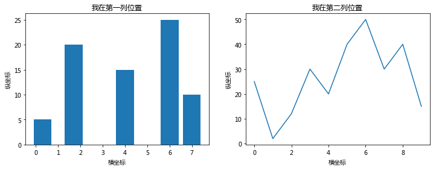


# 获取所有的自带样式


```python
print(plt.style.available) # 打印一个列表
```

    ['bmh', 'classic', 'dark_background', 'fast', 'fivethirtyeight', 'ggplot', 'grayscale', 'seaborn-bright', 'seaborn-colorblind', 'seaborn-dark-palette', 'seaborn-dark', 'seaborn-darkgrid', 'seaborn-deep', 'seaborn-muted', 'seaborn-notebook', 'seaborn-paper', 'seaborn-pastel', 'seaborn-poster', 'seaborn-talk', 'seaborn-ticks', 'seaborn-white', 'seaborn-whitegrid', 'seaborn', 'Solarize_Light2', 'tableau-colorblind10', '_classic_test']
    

# plt.style.use('bmh')


```python
plt.style.use('bmh')

# 正常显示中文字体
plt.rcParams['font.sans-serif']=['Microsoft YaHei']

# 生成一张12*4的图
fig = plt.figure(figsize=(12,4))

# 生成第一个子图在1行2列第一列位置
ax1 = fig.add_subplot(121)

# 生成第二子图在1行2列第二列位置
ax2 = fig.add_subplot(122)

# 柱状图数据
x1 = [0.3, 1.7, 4, 6, 7]
y1 = [5, 20, 15, 25, 10]

# 折线图数据
x2 = np.arange(0,10)
y2 = [25,2,12,30,20,40,50,30,40,15]

# 第一个子图绘图和设置
ax1.bar(x1,y1)
ax1.set(xlabel='横坐标',ylabel='纵坐标',title='我在第一列位置')

# 第二个子图绘图和设置
ax2.plot(x2,y2)
ax2.set(xlabel='横坐标',ylabel='纵坐标',title='我在第二列位置')

plt.show()
```


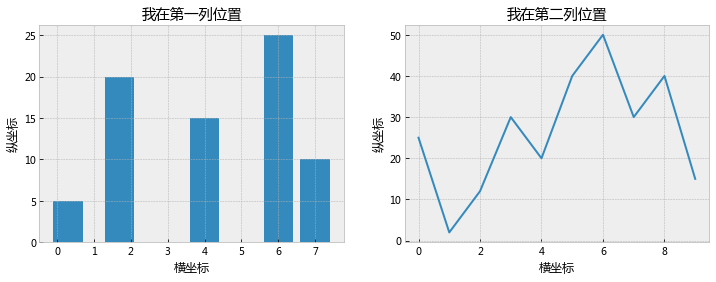


# plt.style.use('classic')


```python
plt.style.use('classic')

# 正常显示中文字体
plt.rcParams['font.sans-serif']=['Microsoft YaHei']

# 生成一张12*4的图
fig = plt.figure(figsize=(12,4))

# 生成第一个子图在1行2列第一列位置
ax1 = fig.add_subplot(121)

# 生成第二子图在1行2列第二列位置
ax2 = fig.add_subplot(122)

# 柱状图数据
x1 = [0.3, 1.7, 4, 6, 7]
y1 = [5, 20, 15, 25, 10]

# 折线图数据
x2 = np.arange(0,10)
y2 = [25,2,12,30,20,40,50,30,40,15]

# 第一个子图绘图和设置
ax1.bar(x1,y1)
ax1.set(xlabel='横坐标',ylabel='纵坐标',title='我在第一列位置')

# 第二个子图绘图和设置
ax2.plot(x2,y2)
ax2.set(xlabel='横坐标',ylabel='纵坐标',title='我在第二列位置')

plt.show()
```


# plt.style.use('dark_background')


```python
plt.style.use('dark_background')

# 正常显示中文字体
plt.rcParams['font.sans-serif']=['Microsoft YaHei']

# 生成一张12*4的图
fig = plt.figure(figsize=(12,4))

# 生成第一个子图在1行2列第一列位置
ax1 = fig.add_subplot(121)

# 生成第二子图在1行2列第二列位置
ax2 = fig.add_subplot(122)

# 柱状图数据
x1 = [0.3, 1.7, 4, 6, 7]
y1 = [5, 20, 15, 25, 10]

# 折线图数据
x2 = np.arange(0,10)
y2 = [25,2,12,30,20,40,50,30,40,15]

# 第一个子图绘图和设置
ax1.bar(x1,y1)
ax1.set(xlabel='横坐标',ylabel='纵坐标',title='我在第一列位置')

# 第二个子图绘图和设置
ax2.plot(x2,y2)
ax2.set(xlabel='横坐标',ylabel='纵坐标',title='我在第二列位置')

plt.show()
```


# plt.style.use('fast')


```python
plt.style.use('fast')

# 正常显示中文字体
plt.rcParams['font.sans-serif']=['Microsoft YaHei']

# 生成一张12*4的图
fig = plt.figure(figsize=(12,4))

# 生成第一个子图在1行2列第一列位置
ax1 = fig.add_subplot(121)

# 生成第二子图在1行2列第二列位置
ax2 = fig.add_subplot(122)

# 柱状图数据
x1 = [0.3, 1.7, 4, 6, 7]
y1 = [5, 20, 15, 25, 10]

# 折线图数据
x2 = np.arange(0,10)
y2 = [25,2,12,30,20,40,50,30,40,15]

# 第一个子图绘图和设置
ax1.bar(x1,y1)
ax1.set(xlabel='横坐标',ylabel='纵坐标',title='我在第一列位置')

# 第二个子图绘图和设置
ax2.plot(x2,y2)
ax2.set(xlabel='横坐标',ylabel='纵坐标',title='我在第二列位置')

plt.show()
```


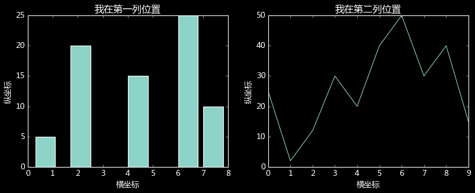


# plt.style.use('fivethirtyeight')


```python
plt.style.use('fivethirtyeight')

# 正常显示中文字体
plt.rcParams['font.sans-serif']=['Microsoft YaHei']

# 生成一张12*4的图
fig = plt.figure(figsize=(12,4))

# 生成第一个子图在1行2列第一列位置
ax1 = fig.add_subplot(121)

# 生成第二子图在1行2列第二列位置
ax2 = fig.add_subplot(122)

# 柱状图数据
x1 = [0.3, 1.7, 4, 6, 7]
y1 = [5, 20, 15, 25, 10]

# 折线图数据
x2 = np.arange(0,10)
y2 = [25,2,12,30,20,40,50,30,40,15]

# 第一个子图绘图和设置
ax1.bar(x1,y1)
ax1.set(xlabel='横坐标',ylabel='纵坐标',title='我在第一列位置')

# 第二个子图绘图和设置
ax2.plot(x2,y2)
ax2.set(xlabel='横坐标',ylabel='纵坐标',title='我在第二列位置')

plt.show()
```


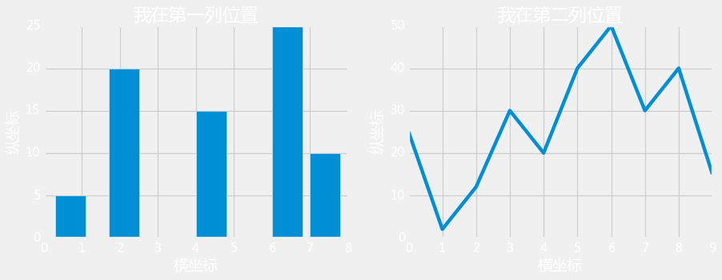


# plt.style.use('ggplot')


```python
plt.style.use('ggplot')

# 正常显示中文字体
plt.rcParams['font.sans-serif']=['Microsoft YaHei']

# 生成一张12*4的图
fig = plt.figure(figsize=(12,4))

# 生成第一个子图在1行2列第一列位置
ax1 = fig.add_subplot(121)

# 生成第二子图在1行2列第二列位置
ax2 = fig.add_subplot(122)

# 柱状图数据
x1 = [0.3, 1.7, 4, 6, 7]
y1 = [5, 20, 15, 25, 10]

# 折线图数据
x2 = np.arange(0,10)
y2 = [25,2,12,30,20,40,50,30,40,15]

# 第一个子图绘图和设置
ax1.bar(x1,y1)
ax1.set(xlabel='横坐标',ylabel='纵坐标',title='我在第一列位置')

# 第二个子图绘图和设置
ax2.plot(x2,y2)
ax2.set(xlabel='横坐标',ylabel='纵坐标',title='我在第二列位置')

plt.show()
```


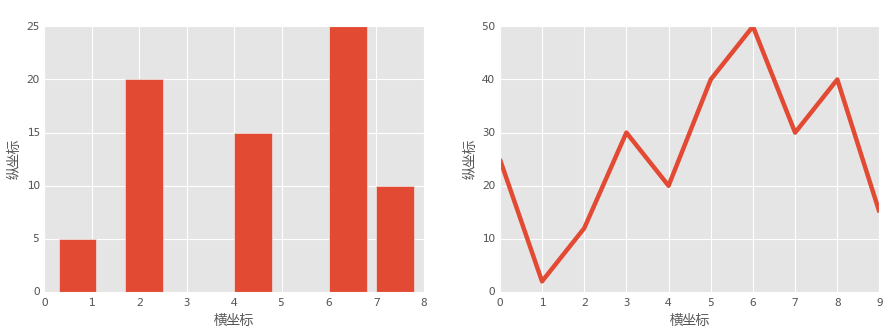


# plt.style.use('grayscale')


```python
plt.style.use('grayscale')

# 正常显示中文字体
plt.rcParams['font.sans-serif']=['Microsoft YaHei']

# 生成一张12*4的图
fig = plt.figure(figsize=(12,4))

# 生成第一个子图在1行2列第一列位置
ax1 = fig.add_subplot(121)

# 生成第二子图在1行2列第二列位置
ax2 = fig.add_subplot(122)

# 柱状图数据
x1 = [0.3, 1.7, 4, 6, 7]
y1 = [5, 20, 15, 25, 10]

# 折线图数据
x2 = np.arange(0,10)
y2 = [25,2,12,30,20,40,50,30,40,15]

# 第一个子图绘图和设置
ax1.bar(x1,y1)
ax1.set(xlabel='横坐标',ylabel='纵坐标',title='我在第一列位置')

# 第二个子图绘图和设置
ax2.plot(x2,y2)
ax2.set(xlabel='横坐标',ylabel='纵坐标',title='我在第二列位置')

plt.show()
```


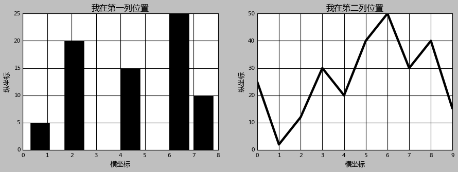


# plt.style.use('seaborn-bright')


```python
plt.style.use('seaborn-bright')

# 正常显示中文字体
plt.rcParams['font.sans-serif']=['Microsoft YaHei']

# 生成一张12*4的图
fig = plt.figure(figsize=(12,4))

# 生成第一个子图在1行2列第一列位置
ax1 = fig.add_subplot(121)

# 生成第二子图在1行2列第二列位置
ax2 = fig.add_subplot(122)

# 柱状图数据
x1 = [0.3, 1.7, 4, 6, 7]
y1 = [5, 20, 15, 25, 10]

# 折线图数据
x2 = np.arange(0,10)
y2 = [25,2,12,30,20,40,50,30,40,15]

# 第一个子图绘图和设置
ax1.bar(x1,y1)
ax1.set(xlabel='横坐标',ylabel='纵坐标',title='我在第一列位置')

# 第二个子图绘图和设置
ax2.plot(x2,y2)
ax2.set(xlabel='横坐标',ylabel='纵坐标',title='我在第二列位置')

plt.show()
```


# plt.style.use('seaborn-colorblind')


```python
plt.style.use('seaborn-colorblind')

# 正常显示中文字体
plt.rcParams['font.sans-serif']=['Microsoft YaHei']

# 生成一张12*4的图
fig = plt.figure(figsize=(12,4))

# 生成第一个子图在1行2列第一列位置
ax1 = fig.add_subplot(121)

# 生成第二子图在1行2列第二列位置
ax2 = fig.add_subplot(122)

# 柱状图数据
x1 = [0.3, 1.7, 4, 6, 7]
y1 = [5, 20, 15, 25, 10]

# 折线图数据
x2 = np.arange(0,10)
y2 = [25,2,12,30,20,40,50,30,40,15]

# 第一个子图绘图和设置
ax1.bar(x1,y1)
ax1.set(xlabel='横坐标',ylabel='纵坐标',title='我在第一列位置')

# 第二个子图绘图和设置
ax2.plot(x2,y2)
ax2.set(xlabel='横坐标',ylabel='纵坐标',title='我在第二列位置')

plt.show()
```


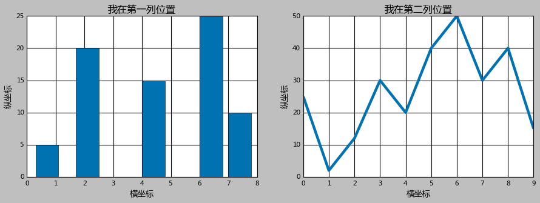


# plt.style.use('seaborn-dark-palette')


```python
plt.style.use('seaborn-dark-palette')

# 正常显示中文字体
plt.rcParams['font.sans-serif']=['Microsoft YaHei']

# 生成一张12*4的图
fig = plt.figure(figsize=(12,4))

# 生成第一个子图在1行2列第一列位置
ax1 = fig.add_subplot(121)

# 生成第二子图在1行2列第二列位置
ax2 = fig.add_subplot(122)

# 柱状图数据
x1 = [0.3, 1.7, 4, 6, 7]
y1 = [5, 20, 15, 25, 10]

# 折线图数据
x2 = np.arange(0,10)
y2 = [25,2,12,30,20,40,50,30,40,15]

# 第一个子图绘图和设置
ax1.bar(x1,y1)
ax1.set(xlabel='横坐标',ylabel='纵坐标',title='我在第一列位置')

# 第二个子图绘图和设置
ax2.plot(x2,y2)
ax2.set(xlabel='横坐标',ylabel='纵坐标',title='我在第二列位置')

plt.show()
```


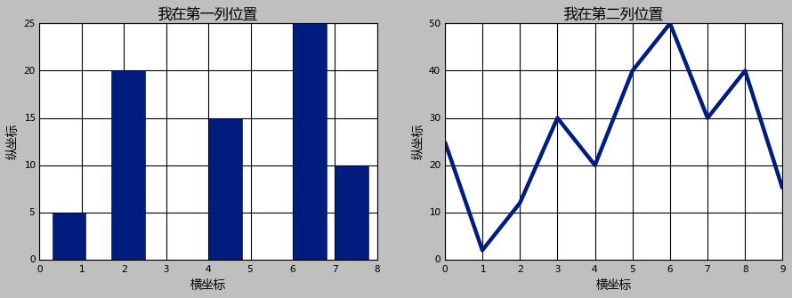


# plt.style.use('seaborn-dark')


```python
plt.style.use('seaborn-dark')

# 正常显示中文字体
plt.rcParams['font.sans-serif']=['Microsoft YaHei']

# 生成一张12*4的图
fig = plt.figure(figsize=(12,4))

# 生成第一个子图在1行2列第一列位置
ax1 = fig.add_subplot(121)

# 生成第二子图在1行2列第二列位置
ax2 = fig.add_subplot(122)

# 柱状图数据
x1 = [0.3, 1.7, 4, 6, 7]
y1 = [5, 20, 15, 25, 10]

# 折线图数据
x2 = np.arange(0,10)
y2 = [25,2,12,30,20,40,50,30,40,15]

# 第一个子图绘图和设置
ax1.bar(x1,y1)
ax1.set(xlabel='横坐标',ylabel='纵坐标',title='我在第一列位置')

# 第二个子图绘图和设置
ax2.plot(x2,y2)
ax2.set(xlabel='横坐标',ylabel='纵坐标',title='我在第二列位置')

plt.show()
```


# plt.style.use('seaborn-darkgrid')


```python
plt.style.use('seaborn-darkgrid')

# 正常显示中文字体
plt.rcParams['font.sans-serif']=['Microsoft YaHei']

# 生成一张12*4的图
fig = plt.figure(figsize=(12,4))

# 生成第一个子图在1行2列第一列位置
ax1 = fig.add_subplot(121)

# 生成第二子图在1行2列第二列位置
ax2 = fig.add_subplot(122)

# 柱状图数据
x1 = [0.3, 1.7, 4, 6, 7]
y1 = [5, 20, 15, 25, 10]

# 折线图数据
x2 = np.arange(0,10)
y2 = [25,2,12,30,20,40,50,30,40,15]

# 第一个子图绘图和设置
ax1.bar(x1,y1)
ax1.set(xlabel='横坐标',ylabel='纵坐标',title='我在第一列位置')

# 第二个子图绘图和设置
ax2.plot(x2,y2)
ax2.set(xlabel='横坐标',ylabel='纵坐标',title='我在第二列位置')

plt.show()
```


# plt.style.use('seaborn-deep')


```python
plt.style.use('seaborn-deep')

# 正常显示中文字体
plt.rcParams['font.sans-serif']=['Microsoft YaHei']

# 生成一张12*4的图
fig = plt.figure(figsize=(12,4))

# 生成第一个子图在1行2列第一列位置
ax1 = fig.add_subplot(121)

# 生成第二子图在1行2列第二列位置
ax2 = fig.add_subplot(122)

# 柱状图数据
x1 = [0.3, 1.7, 4, 6, 7]
y1 = [5, 20, 15, 25, 10]

# 折线图数据
x2 = np.arange(0,10)
y2 = [25,2,12,30,20,40,50,30,40,15]

# 第一个子图绘图和设置
ax1.bar(x1,y1)
ax1.set(xlabel='横坐标',ylabel='纵坐标',title='我在第一列位置')

# 第二个子图绘图和设置
ax2.plot(x2,y2)
ax2.set(xlabel='横坐标',ylabel='纵坐标',title='我在第二列位置')

plt.show()
```


# plt.style.use('seaborn-muted')


```python
plt.style.use('seaborn-muted')

# 正常显示中文字体
plt.rcParams['font.sans-serif']=['Microsoft YaHei']

# 生成一张12*4的图
fig = plt.figure(figsize=(12,4))

# 生成第一个子图在1行2列第一列位置
ax1 = fig.add_subplot(121)

# 生成第二子图在1行2列第二列位置
ax2 = fig.add_subplot(122)

# 柱状图数据
x1 = [0.3, 1.7, 4, 6, 7]
y1 = [5, 20, 15, 25, 10]

# 折线图数据
x2 = np.arange(0,10)
y2 = [25,2,12,30,20,40,50,30,40,15]

# 第一个子图绘图和设置
ax1.bar(x1,y1)
ax1.set(xlabel='横坐标',ylabel='纵坐标',title='我在第一列位置')

# 第二个子图绘图和设置
ax2.plot(x2,y2)
ax2.set(xlabel='横坐标',ylabel='纵坐标',title='我在第二列位置')

plt.show()
```


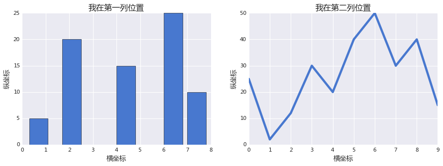


# plt.style.use('seaborn-notebook')


```python
plt.style.use('seaborn-notebook')

# 正常显示中文字体
plt.rcParams['font.sans-serif']=['Microsoft YaHei']

# 生成一张12*4的图
fig = plt.figure(figsize=(12,4))

# 生成第一个子图在1行2列第一列位置
ax1 = fig.add_subplot(121)

# 生成第二子图在1行2列第二列位置
ax2 = fig.add_subplot(122)

# 柱状图数据
x1 = [0.3, 1.7, 4, 6, 7]
y1 = [5, 20, 15, 25, 10]

# 折线图数据
x2 = np.arange(0,10)
y2 = [25,2,12,30,20,40,50,30,40,15]

# 第一个子图绘图和设置
ax1.bar(x1,y1)
ax1.set(xlabel='横坐标',ylabel='纵坐标',title='我在第一列位置')

# 第二个子图绘图和设置
ax2.plot(x2,y2)
ax2.set(xlabel='横坐标',ylabel='纵坐标',title='我在第二列位置')

plt.show()
```


# plt.style.use('seaborn-paper')


```python
plt.style.use('seaborn-paper')

# 正常显示中文字体
plt.rcParams['font.sans-serif']=['Microsoft YaHei']

# 生成一张12*4的图
fig = plt.figure(figsize=(12,4))

# 生成第一个子图在1行2列第一列位置
ax1 = fig.add_subplot(121)

# 生成第二子图在1行2列第二列位置
ax2 = fig.add_subplot(122)

# 柱状图数据
x1 = [0.3, 1.7, 4, 6, 7]
y1 = [5, 20, 15, 25, 10]

# 折线图数据
x2 = np.arange(0,10)
y2 = [25,2,12,30,20,40,50,30,40,15]

# 第一个子图绘图和设置
ax1.bar(x1,y1)
ax1.set(xlabel='横坐标',ylabel='纵坐标',title='我在第一列位置')

# 第二个子图绘图和设置
ax2.plot(x2,y2)
ax2.set(xlabel='横坐标',ylabel='纵坐标',title='我在第二列位置')

plt.show()
```


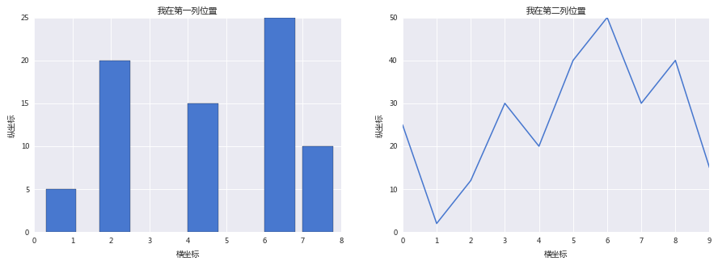


# plt.style.use('seaborn-pastel')


```python
plt.style.use('seaborn-pastel')

# 正常显示中文字体
plt.rcParams['font.sans-serif']=['Microsoft YaHei']

# 生成一张12*4的图
fig = plt.figure(figsize=(12,4))

# 生成第一个子图在1行2列第一列位置
ax1 = fig.add_subplot(121)

# 生成第二子图在1行2列第二列位置
ax2 = fig.add_subplot(122)

# 柱状图数据
x1 = [0.3, 1.7, 4, 6, 7]
y1 = [5, 20, 15, 25, 10]

# 折线图数据
x2 = np.arange(0,10)
y2 = [25,2,12,30,20,40,50,30,40,15]

# 第一个子图绘图和设置
ax1.bar(x1,y1)
ax1.set(xlabel='横坐标',ylabel='纵坐标',title='我在第一列位置')

# 第二个子图绘图和设置
ax2.plot(x2,y2)
ax2.set(xlabel='横坐标',ylabel='纵坐标',title='我在第二列位置')

plt.show()
```


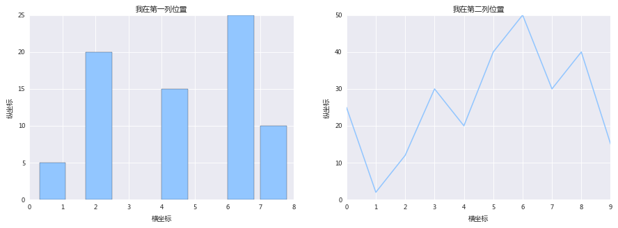


# plt.style.use('seaborn-poster')


```python
plt.style.use('seaborn-poster')

# 正常显示中文字体
plt.rcParams['font.sans-serif']=['Microsoft YaHei']

# 生成一张12*4的图
fig = plt.figure(figsize=(12,4))

# 生成第一个子图在1行2列第一列位置
ax1 = fig.add_subplot(121)

# 生成第二子图在1行2列第二列位置
ax2 = fig.add_subplot(122)

# 柱状图数据
x1 = [0.3, 1.7, 4, 6, 7]
y1 = [5, 20, 15, 25, 10]

# 折线图数据
x2 = np.arange(0,10)
y2 = [25,2,12,30,20,40,50,30,40,15]

# 第一个子图绘图和设置
ax1.bar(x1,y1)
ax1.set(xlabel='横坐标',ylabel='纵坐标',title='我在第一列位置')

# 第二个子图绘图和设置
ax2.plot(x2,y2)
ax2.set(xlabel='横坐标',ylabel='纵坐标',title='我在第二列位置')

plt.show()
```


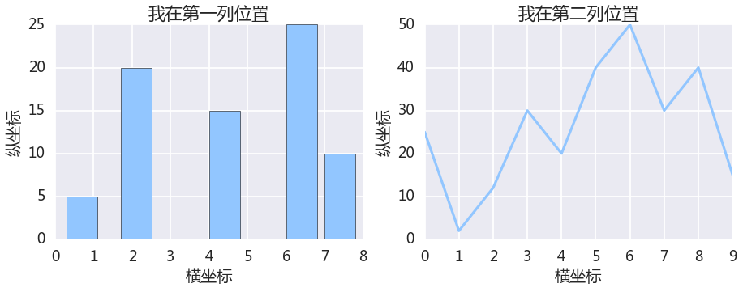


# plt.style.use('seaborn-talk')


```python
plt.style.use('seaborn-talk')

# 正常显示中文字体
plt.rcParams['font.sans-serif']=['Microsoft YaHei']

# 生成一张12*4的图
fig = plt.figure(figsize=(12,4))

# 生成第一个子图在1行2列第一列位置
ax1 = fig.add_subplot(121)

# 生成第二子图在1行2列第二列位置
ax2 = fig.add_subplot(122)

# 柱状图数据
x1 = [0.3, 1.7, 4, 6, 7]
y1 = [5, 20, 15, 25, 10]

# 折线图数据
x2 = np.arange(0,10)
y2 = [25,2,12,30,20,40,50,30,40,15]

# 第一个子图绘图和设置
ax1.bar(x1,y1)
ax1.set(xlabel='横坐标',ylabel='纵坐标',title='我在第一列位置')

# 第二个子图绘图和设置
ax2.plot(x2,y2)
ax2.set(xlabel='横坐标',ylabel='纵坐标',title='我在第二列位置')

plt.show()
```


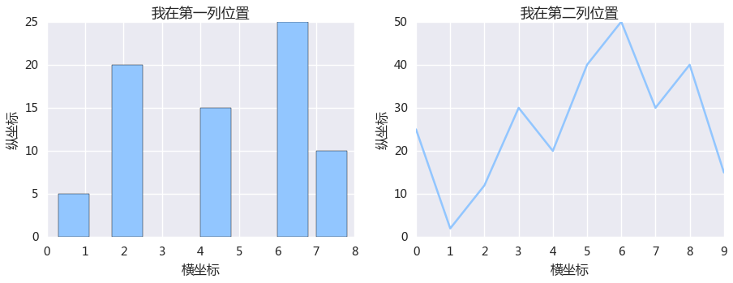


# plt.style.use('seaborn-ticks')


```python
plt.style.use('seaborn-ticks')

# 正常显示中文字体
plt.rcParams['font.sans-serif']=['Microsoft YaHei']

# 生成一张12*4的图
fig = plt.figure(figsize=(12,4))

# 生成第一个子图在1行2列第一列位置
ax1 = fig.add_subplot(121)

# 生成第二子图在1行2列第二列位置
ax2 = fig.add_subplot(122)

# 柱状图数据
x1 = [0.3, 1.7, 4, 6, 7]
y1 = [5, 20, 15, 25, 10]

# 折线图数据
x2 = np.arange(0,10)
y2 = [25,2,12,30,20,40,50,30,40,15]

# 第一个子图绘图和设置
ax1.bar(x1,y1)
ax1.set(xlabel='横坐标',ylabel='纵坐标',title='我在第一列位置')

# 第二个子图绘图和设置
ax2.plot(x2,y2)
ax2.set(xlabel='横坐标',ylabel='纵坐标',title='我在第二列位置')

plt.show()
```


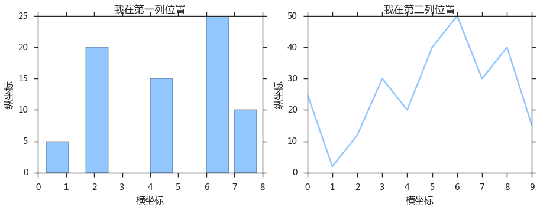


# plt.style.use('seaborn-white')


```python
plt.style.use('seaborn-white')

# 正常显示中文字体
plt.rcParams['font.sans-serif']=['Microsoft YaHei']

# 生成一张12*4的图
fig = plt.figure(figsize=(12,4))

# 生成第一个子图在1行2列第一列位置
ax1 = fig.add_subplot(121)

# 生成第二子图在1行2列第二列位置
ax2 = fig.add_subplot(122)

# 柱状图数据
x1 = [0.3, 1.7, 4, 6, 7]
y1 = [5, 20, 15, 25, 10]

# 折线图数据
x2 = np.arange(0,10)
y2 = [25,2,12,30,20,40,50,30,40,15]

# 第一个子图绘图和设置
ax1.bar(x1,y1)
ax1.set(xlabel='横坐标',ylabel='纵坐标',title='我在第一列位置')

# 第二个子图绘图和设置
ax2.plot(x2,y2)
ax2.set(xlabel='横坐标',ylabel='纵坐标',title='我在第二列位置')

plt.show()
```


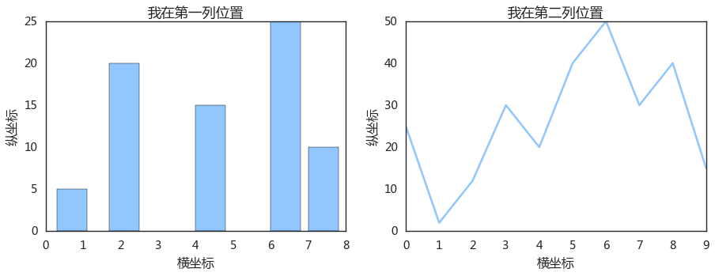


# plt.style.use('seaborn-whitegrid')


```python
plt.style.use('seaborn-whitegrid')

# 正常显示中文字体
plt.rcParams['font.sans-serif']=['Microsoft YaHei']

# 生成一张12*4的图
fig = plt.figure(figsize=(12,4))

# 生成第一个子图在1行2列第一列位置
ax1 = fig.add_subplot(121)

# 生成第二子图在1行2列第二列位置
ax2 = fig.add_subplot(122)

# 柱状图数据
x1 = [0.3, 1.7, 4, 6, 7]
y1 = [5, 20, 15, 25, 10]

# 折线图数据
x2 = np.arange(0,10)
y2 = [25,2,12,30,20,40,50,30,40,15]

# 第一个子图绘图和设置
ax1.bar(x1,y1)
ax1.set(xlabel='横坐标',ylabel='纵坐标',title='我在第一列位置')

# 第二个子图绘图和设置
ax2.plot(x2,y2)
ax2.set(xlabel='横坐标',ylabel='纵坐标',title='我在第二列位置')

plt.show()
```


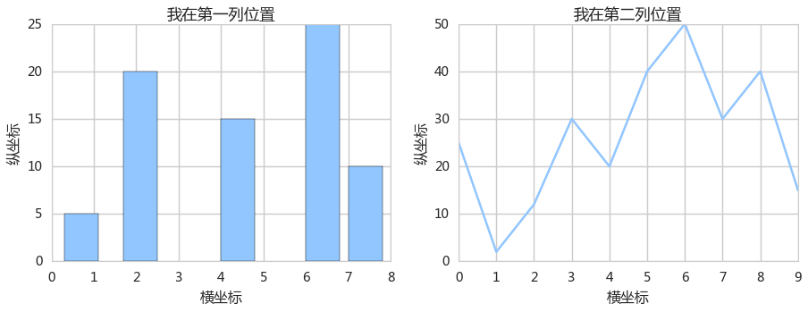


# plt.style.use('seaborn')


```python
plt.style.use('seaborn')

# 正常显示中文字体
plt.rcParams['font.sans-serif']=['Microsoft YaHei']

# 生成一张12*4的图
fig = plt.figure(figsize=(12,4))

# 生成第一个子图在1行2列第一列位置
ax1 = fig.add_subplot(121)

# 生成第二子图在1行2列第二列位置
ax2 = fig.add_subplot(122)

# 柱状图数据
x1 = [0.3, 1.7, 4, 6, 7]
y1 = [5, 20, 15, 25, 10]

# 折线图数据
x2 = np.arange(0,10)
y2 = [25,2,12,30,20,40,50,30,40,15]

# 第一个子图绘图和设置
ax1.bar(x1,y1)
ax1.set(xlabel='横坐标',ylabel='纵坐标',title='我在第一列位置')

# 第二个子图绘图和设置
ax2.plot(x2,y2)
ax2.set(xlabel='横坐标',ylabel='纵坐标',title='我在第二列位置')

plt.show()
```


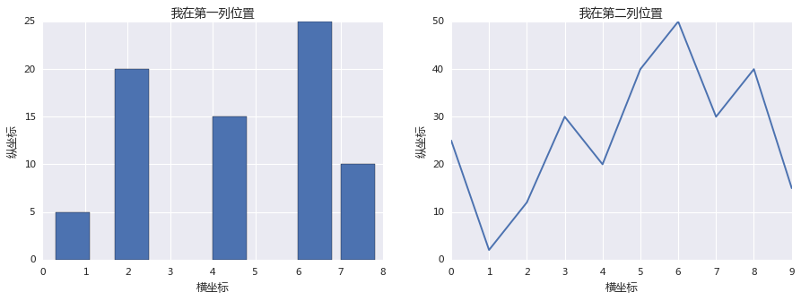


# plt.style.use('Solarize_Light2')


```python
plt.style.use('Solarize_Light2')

# 正常显示中文字体
plt.rcParams['font.sans-serif']=['Microsoft YaHei']

# 生成一张12*4的图
fig = plt.figure(figsize=(12,4))

# 生成第一个子图在1行2列第一列位置
ax1 = fig.add_subplot(121)

# 生成第二子图在1行2列第二列位置
ax2 = fig.add_subplot(122)

# 柱状图数据
x1 = [0.3, 1.7, 4, 6, 7]
y1 = [5, 20, 15, 25, 10]

# 折线图数据
x2 = np.arange(0,10)
y2 = [25,2,12,30,20,40,50,30,40,15]

# 第一个子图绘图和设置
ax1.bar(x1,y1)
ax1.set(xlabel='横坐标',ylabel='纵坐标',title='我在第一列位置')

# 第二个子图绘图和设置
ax2.plot(x2,y2)
ax2.set(xlabel='横坐标',ylabel='纵坐标',title='我在第二列位置')

plt.show()
```


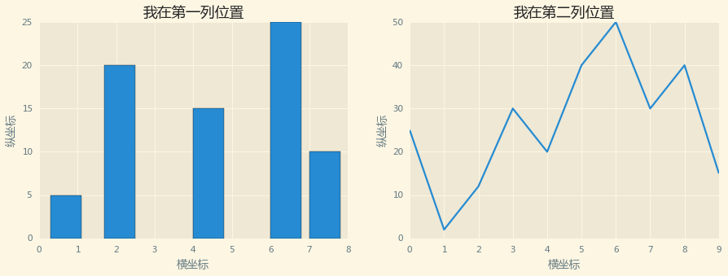


# plt.style.use('tableau-colorblind10')


```python
plt.style.use('tableau-colorblind10')

# 正常显示中文字体
plt.rcParams['font.sans-serif']=['Microsoft YaHei']

# 生成一张12*4的图
fig = plt.figure(figsize=(12,4))

# 生成第一个子图在1行2列第一列位置
ax1 = fig.add_subplot(121)

# 生成第二子图在1行2列第二列位置
ax2 = fig.add_subplot(122)

# 柱状图数据
x1 = [0.3, 1.7, 4, 6, 7]
y1 = [5, 20, 15, 25, 10]

# 折线图数据
x2 = np.arange(0,10)
y2 = [25,2,12,30,20,40,50,30,40,15]

# 第一个子图绘图和设置
ax1.bar(x1,y1)
ax1.set(xlabel='横坐标',ylabel='纵坐标',title='我在第一列位置')

# 第二个子图绘图和设置
ax2.plot(x2,y2)
ax2.set(xlabel='横坐标',ylabel='纵坐标',title='我在第二列位置')

plt.show()
```


# plt.style.use('_classic_test')


```python
plt.style.use('_classic_test')

# 正常显示中文字体
plt.rcParams['font.sans-serif']=['Microsoft YaHei']

# 生成一张12*4的图
fig = plt.figure(figsize=(12,4))

# 生成第一个子图在1行2列第一列位置
ax1 = fig.add_subplot(121)

# 生成第二子图在1行2列第二列位置
ax2 = fig.add_subplot(122)

# 柱状图数据
x1 = [0.3, 1.7, 4, 6, 7]
y1 = [5, 20, 15, 25, 10]

# 折线图数据
x2 = np.arange(0,10)
y2 = [25,2,12,30,20,40,50,30,40,15]

# 第一个子图绘图和设置
ax1.bar(x1,y1)
ax1.set(xlabel='横坐标',ylabel='纵坐标',title='我在第一列位置')

# 第二个子图绘图和设置
ax2.plot(x2,y2)
ax2.set(xlabel='横坐标',ylabel='纵坐标',title='我在第二列位置')

plt.show()
```


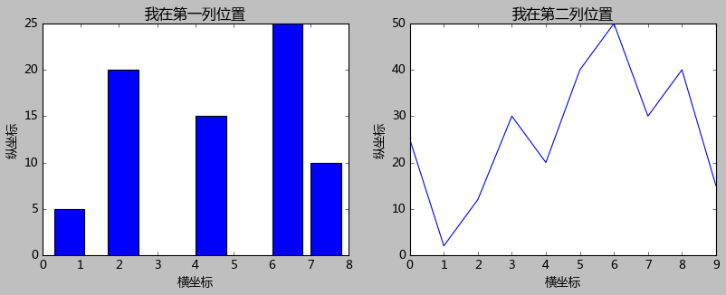


## 绘图选一种自己喜欢的样式画布风格，用两张子图分别绘一个柱状图和折线图来做对比。
